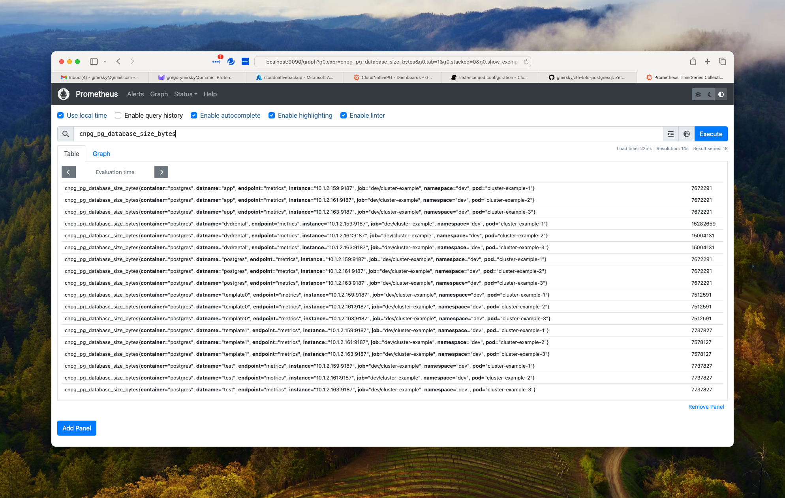
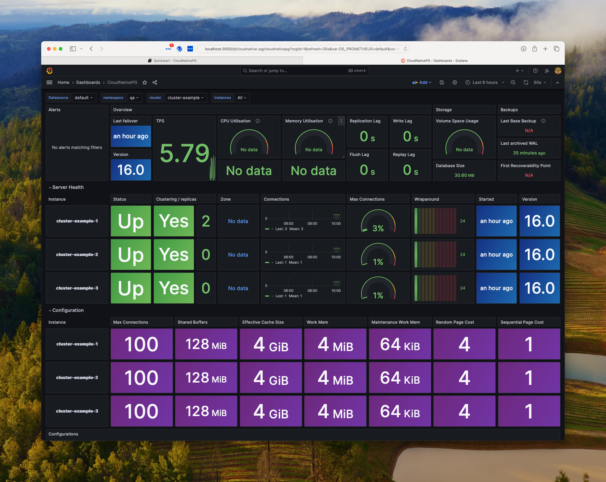
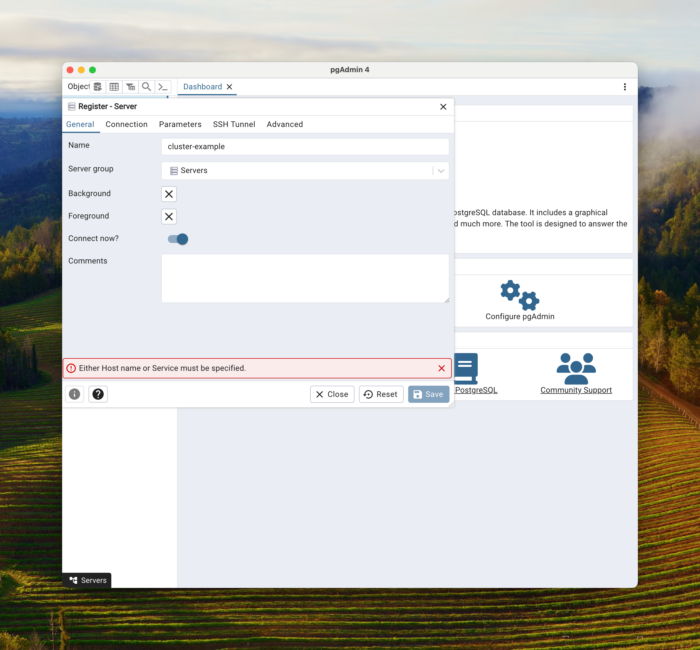
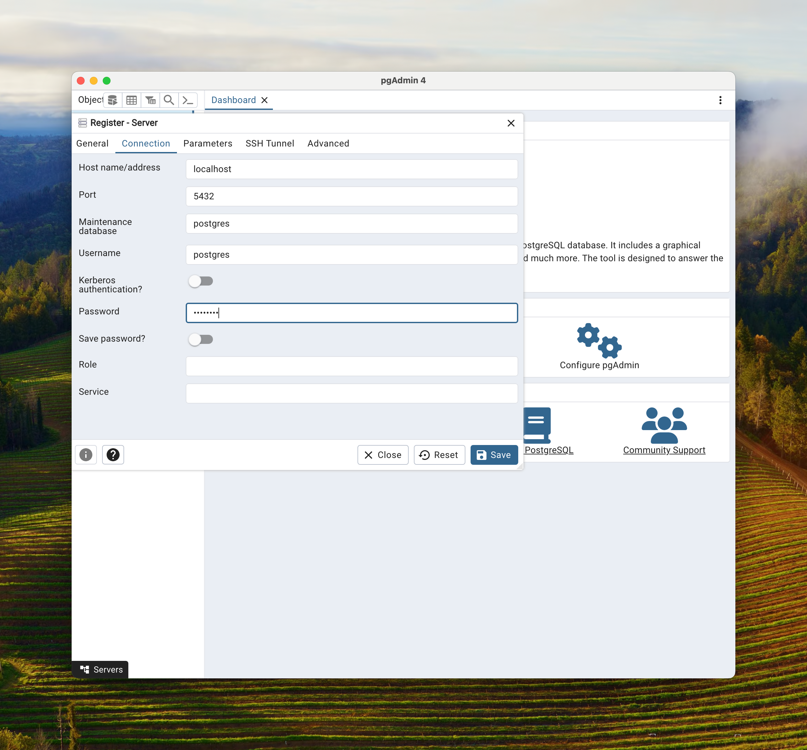
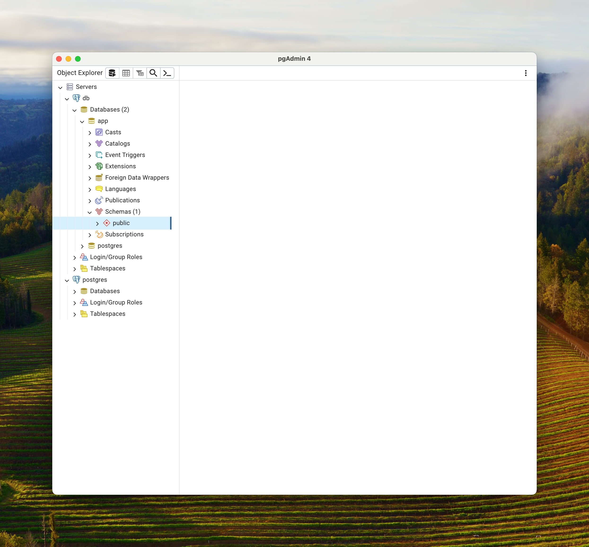
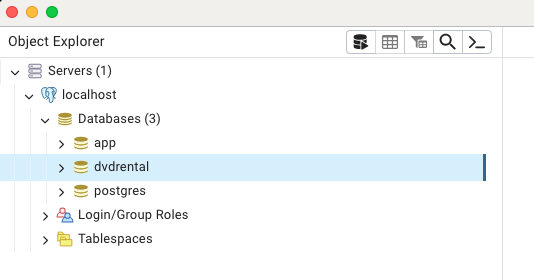
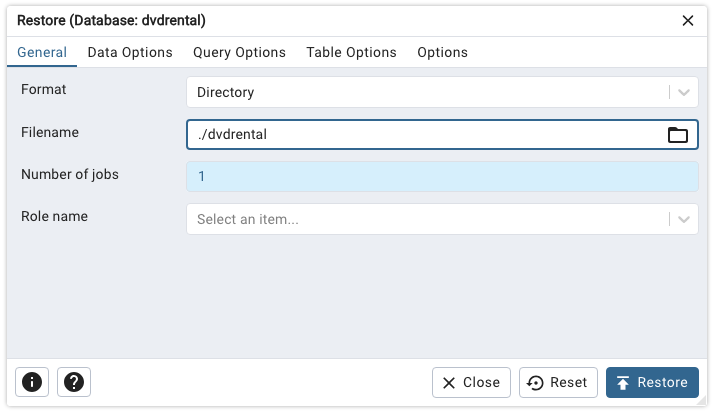
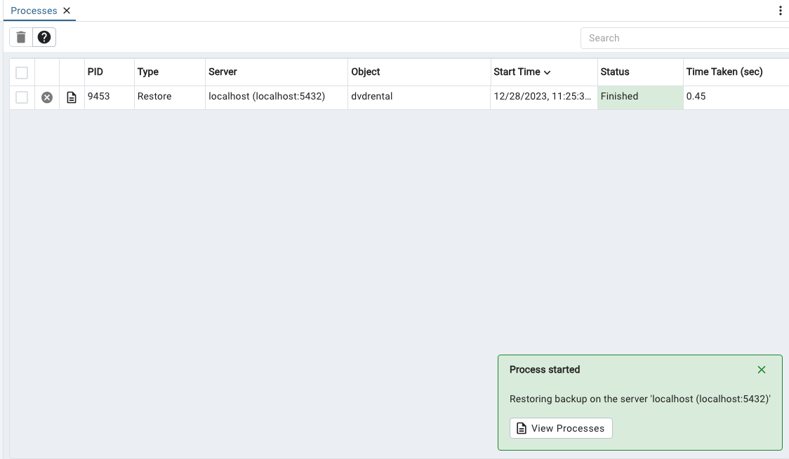
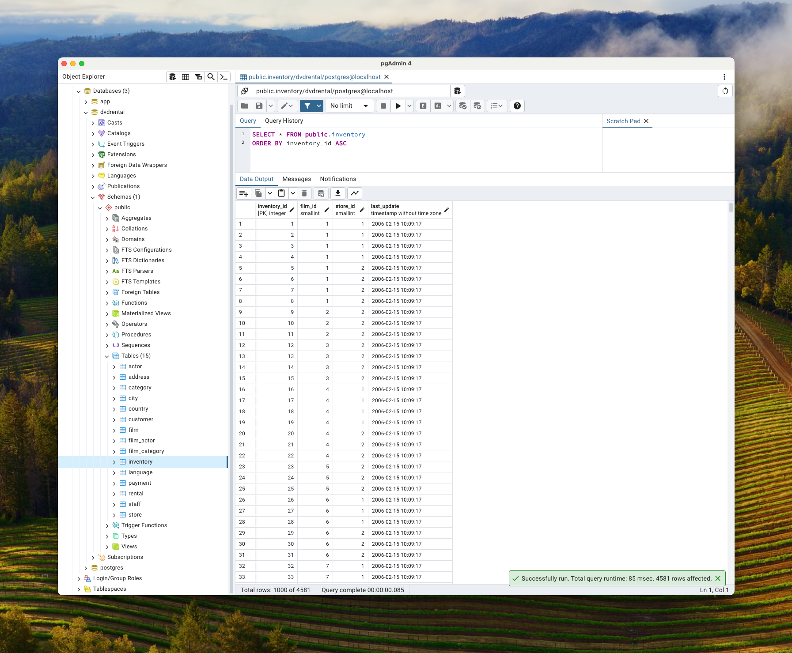

# Zero to Hero: A Kubernetes PostgreSQL cluster

Zero to Hero: A Kubernetes PostgreSQL cluster tutorial from beginning to end. This is a fully detailed step-by-step process tutorial with minimal skills assumed. 

You will build a clustered Postgres database with automated and scheduled backups to cloud storage, monitoring with Prometheus and a Grafana dashboard. You will also build an ingress controller so that your database, Prometheus and Grafana are available outside of your Kubernetes cluster. 

This tutorial uses Kubectl, Krew, Azure CLI or AWS CLI, Helm, Base64 and pgAdmin. Not familiar with all of these? Don't worry. There are detailed step by step instructions for you to follow along with so you can learn by doing.

**Revision Date:** `08-January-2024`

------

## Assumptions

This tutorial is being deployed on a single node local Kubernetes cluster using Docker Desktop Kubernetes. If you wish to use another Kubernetes micro environment like  Minikube, Kind, etc. you may need to make some adjustments to the code.

Use the command `docker version` to check the version of Docker you have installed. If you don't have Docker installed, don't worry there are links below to get you started on the installation process.

```bash
# Get the docker version
docker version 

Client:
 Cloud integration: v1.0.35+desktop.5
 Version:           24.0.7
 API version:       1.43
 Go version:        go1.20.10
 Git commit:        afdd53b
 Built:             Thu Oct 26 09:04:20 2023
 OS/Arch:           darwin/arm64
 Context:           desktop-linux

Server: Docker Desktop 4.26.1 (131620)
 Engine:
  Version:          24.0.7
  API version:      1.43 (minimum version 1.12)
  Go version:       go1.20.10
  Git commit:       311b9ff
  Built:            Thu Oct 26 09:08:15 2023
  OS/Arch:          linux/arm64
  Experimental:     false
 containerd:
  Version:          1.6.25
  GitCommit:        d8f198a4ed8892c764191ef7b3b06d8a2eeb5c7f
 runc:
  Version:          1.1.10
  GitCommit:        v1.1.10-0-g18a0cb0
 docker-init:
  Version:          0.19.0
  GitCommit:        de40ad0
```

The commands below were tested in a Zsh/Bash command line environment. Some of the commands like base64 will be executed differently in Windows and you will need to adjust accordingly.

## Prerequisites

### A cloud storage account

A Azure or AWS account to store the cluster automated and on-demand backups into. Please refer to the sections below to provision the proper infrastructure such as an AWS S3 bucket or an Azure storage account.

For this tutorial we will use an Azure Storage Account Container but we will provide instructions to use a AWS S3 bucket too.

#### Azure Blob Storage

For Azure, if you do not have a resource group or storage account already set up you can use the following [Azure CLI ](https://learn.microsoft.com/en-us/cli/azure/install-azure-cli) commands:

```bash
# log into your Azure account
az login
```

Take note of the value in `homeTenantID` in the JSON output. (IDs have been redacted.)

```json
[
  {
    "cloudName": "AzureCloud",
    "homeTenantId": "********-8496-4ddd-a787-************",
    "id": "********-014c-4a5e-95fe-************",
    "isDefault": true,
    "managedByTenants": [],
    "name": "Pay-as-you-go",
    "state": "Enabled",
    "tenantId": "********-8496-4ddd-a787-************",
    "user": {
      "name": "********@gmail.com",
      "type": "user"
    }
  }
]
```

Create the Azure Resource group

```bash
# create the Azure resource group that will host the Storage Account
az group create -l eastus -n cluster-example-rg
```

You should get `"provisioningState": "Succeeded"` in the output JSON

```json
{
  "id": "/subscriptions/********-014c-4a5e-95fe-************/resourceGroups/cluster-example-rg",
  "location": "eastus",
  "managedBy": null,
  "name": "cluster-example-rg",
  "properties": {
    "provisioningState": "Succeeded"
  },
  "tags": null,
  "type": "Microsoft.Resources/resourceGroups"
}
```

Create the Azure Storage Account. (Note: You cannot use dashes in the storage account name.)

```bash
# create the Azure Storage Account
az storage account create -n clusterexamplesa -g cluster-example-rg -l eastus
```

Verify in the voluminous JSON output that `"provisioningState": "Succeeded"`, is present to determine if your storage account was created.

Create a container in the storage account we just created.

```bash
# create the Azure Storage Account Container
az storage container create -n clusterexample --account-name clusterexamplesa --auth-mode login
```

If everything goes correctly we should get the following JSON.

```json
{
  "created": true
}
```

Let's list the Azure Storage Containers in our Azure Storage Account

```bash
# List Azure storage account containers
az storage container list --account-name clusterexamplesa
```

The output should look like this:

```json
[
  {
    "deleted": null,
    "encryptionScope": {
      "defaultEncryptionScope": "$account-encryption-key",
      "preventEncryptionScopeOverride": false
    },
    "immutableStorageWithVersioningEnabled": false,
    "metadata": null,
    "name": "clusterexample",
    "properties": {
      "etag": "\"0x8DC06E6A573068B\"",
      "hasImmutabilityPolicy": false,
      "hasLegalHold": false,
      "lastModified": "2023-12-27T14:18:06+00:00",
      "lease": {
        "duration": null,
        "state": "available",
        "status": "unlocked"
      },
      "publicAccess": null
    },
    "version": null
  }
]
```

Now we have to get theAzure key for the Storage Account so that our cluster can store its automated and on demand backup to the Azure Storage Account Blob Container we just created.

```bash
# Get the storage account key list for our storage account
az storage account keys list --account-name clusterexamplesa --resource-group cluster-example-rg
```

You should get an access key back in the following form. (The keys below have been redacted.) Make a note of this key. You will need it later.

```
[
  {
    "creationTime": "2023-12-27T17:51:34.896182+00:00",
    "keyName": "key1",
    "permissions": "FULL",
    "value": "y+U5+9dS************************************************************Ryx0k4+ASt0iuHlQ=="
  },
  {
    "creationTime": "2023-12-27T14:03:44.634621+00:00",
    "keyName": "key2",
    "permissions": "FULL",
    "value": "TfdkgSUY**********************************************************sQwHJozs+AStQwEe0g=="
  }
]
```

To get the first key's value use the following:

```bash
az storage account keys list --account-name clusterexamplesa --resource-group cluster-example-rg --query "[0].value"

"y+U5+9dS************************************************************Ryx0k4+ASt0iuHlQ=="
```

Save this key for later use.

#### AWS S3 Bucket

Install the [AWS CLI](https://docs.aws.amazon.com/cli/latest/userguide/getting-started-install.html) and configure as per the AWS documentation, if you have not already done so.

Using the AWS CLI with the default profile create the AWS S3 bucket. Choose a AWS region that makes sense for your deployment and change the name of the S3 bucket. S3 buckets must be unique. You can add your account number to the end of the bucket name to make it unique. 

To get your AWS account number use the following command:

```bash
# Get your AWS Account number
aws sts get-caller-identity --query Account --output text
```

To get a list of available AWS regions for your account use the following command:

```bash
# Get a list of regions for your AWS account
aws ec2 describe-regions --output table
```

To provision the AWS S3 bucket, use the following command

```bash
# Provision the AWS S3 bucket
aws s3api create-bucket --bucket cluster-example-backup --region us-east-1 --output json --profile default
```

Please install the below packages to your environment. 

### Kubectl

Kubectl should have been installed with Docker Desktop when the Kubernetes option is enabled. If not [see installing Kubectl](https://kubernetes.io/docs/tasks/tools/)

```bash
# get the current version of our kubectl client and the version of our kubernetes cluster
kubectl version                                                                                           

Client Version: v1.29.1
Kustomize Version: v5.0.4-0.20230601165947-6ce0bf390ce3
Server Version: v1.28.2
```

### Krew

The Cloud Native Kubectl plugin is needed to generate the Postgres Operator. [See installing Krew on how to install this plug in.](https://krew.sigs.k8s.io/docs/user-guide/setup/install/) 

```bash
# get the version of the krew kubectl plugin
kubectl krew version                                                                                     

OPTION            VALUE
GitTag            v0.4.4
GitCommit         343e657d
IndexURI          https://github.com/kubernetes-sigs/krew-index.git
BasePath          /Users/gregorymirsky/.krew
IndexPath         /Users/gregorymirsky/.krew/index/default
InstallPath       /Users/gregorymirsky/.krew/store
BinPath           /Users/gregorymirsky/.krew/bin
DetectedPlatform  darwin/arm64
```

### Helm

 Helm is required for chart installation. [See installing Helm](https://helm.sh/docs/intro/install/)

```bash
# verify the Helm version installed
helm version                                                                                             

version.BuildInfo{Version:"v3.14.0", GitCommit:"3fc9f4b2638e76f26739cd77c7017139be81d0ea", GitTreeState:"clean", GoVersion:"go1.21.6"}
```

### pgAdmin 

pgAdmin should be installed on your host system to connect to the databases. [See installing pgAdmin](https://www.pgadmin.org/download/)

### Base64

#### Linux

Install base64 (on Linux) is included in coreutils. Use your distribution's package manager to install coreutils.

#### Mac

Install base64 (on Mac) 

```bash
# Install base64
brew install base64
```

### Windows

Install base64 (on Windows) using PowerShell

```powershell
# Install base64
Install-Module -Name Base64
```

Verify the Base64 version

```bash
# check the base64 version
base64 --version                                                                                         

base64 1.5
Last revised: 10th June 2007
The latest version is always available
at http://www.fourmilab.ch/webtools/base64
```

## Install the cnpg plugin using Krew

```bash
# Install the Krew Kubectl plugin
kubectl krew install cnpg
```

```bash
# Check the cnpg plugin and check the version
kubectl cnpg version
Build: {Version:1.22.0 Commit:86b9dc80 Date:2023-12-21}
```

Updating krew and cnpg plugins (if plugins are already installed.)

```bash
# Update krew plugin
kubectl krew upgrade
```

```bash
# Update cnpg plugin
kubectl krew upgrade cnpg
```

## Starting off

Starting with a clean Kubernetes cluster, let's get an idea of what is running already in the cluster before we begin.

```bash
# See what nodes we have running in our docker desktop kubernetes cluster
kubectl get nodes 

NAME             STATUS   ROLES           AGE   VERSION
docker-desktop   Ready    control-plane   16h   v1.28.2
```

Now let's see what is already running on our node.

```bash
# See what is running in our Kubernetes cluseter
kubectl get  all --all-namespaces   

NAMESPACE     NAME                                         READY   STATUS    RESTARTS       AGE
kube-system   pod/coredns-5dd5756b68-57m9d                 1/1     Running   1 (39m ago)    45h
kube-system   pod/coredns-5dd5756b68-wb89s                 1/1     Running   1 (39m ago)    45h
kube-system   pod/etcd-docker-desktop                      1/1     Running   39 (39m ago)   45h
kube-system   pod/kube-apiserver-docker-desktop            1/1     Running   39 (39m ago)   45h
kube-system   pod/kube-controller-manager-docker-desktop   1/1     Running   39 (39m ago)   45h
kube-system   pod/kube-proxy-4nrg8                         1/1     Running   1 (39m ago)    45h
kube-system   pod/kube-scheduler-docker-desktop            1/1     Running   39 (39m ago)   45h
kube-system   pod/storage-provisioner                      1/1     Running   2 (39m ago)    45h
kube-system   pod/vpnkit-controller                        1/1     Running   1 (39m ago)    45h

NAMESPACE     NAME                 TYPE        CLUSTER-IP   EXTERNAL-IP   PORT(S)                  AGE
default       service/kubernetes   ClusterIP   10.96.0.1    <none>        443/TCP                  45h
kube-system   service/kube-dns     ClusterIP   10.96.0.10   <none>        53/UDP,53/TCP,9153/TCP   45h

NAMESPACE     NAME                        DESIRED   CURRENT   READY   UP-TO-DATE   AVAILABLE   NODE SELECTOR            AGE
kube-system   daemonset.apps/kube-proxy   1         1         1       1            1           kubernetes.io/os=linux   45h

NAMESPACE     NAME                      READY   UP-TO-DATE   AVAILABLE   AGE
kube-system   deployment.apps/coredns   2/2     2            2           45h

NAMESPACE     NAME                                 DESIRED   CURRENT   READY   AGE
kube-system   replicaset.apps/coredns-5dd5756b68   2         2         2       45h
```

## Create namespaces

We will only need the dev namespace for this tutorial. The higher environments, qa, beta and prod are all optional.

```bash
# Create a new namespace called 'dev'
kubectl create namespace dev --dry-run=client -o yaml | kubectl apply -f -
```

```bash
# List out the namespaces in the kube
kubectl get namespaces --all-namespaces --show-labels                                                     

NAME              STATUS   AGE   LABELS
default           Active   45h   kubernetes.io/metadata.name=default
dev               Active   40s   kubernetes.io/metadata.name=dev
kube-node-lease   Active   45h   kubernetes.io/metadata.name=kube-node-lease
kube-public       Active   45h   kubernetes.io/metadata.name=kube-public
kube-system       Active   45h   kubernetes.io/metadata.name=kube-system
```

## Generate and install the CloudNativePG Operator

Generate the operator yaml manifest. The `-n` flag defines the namespace where the operator is deployed to and the replicas flag tells us how many replicas of the operator should be installed (note: number of operator replicas - not Postgres instances). For our demonstration we will pick one node but in production we would likely have 3, one for each cloud availability zone in the region.

```bash
# Generate the YAML manifest with 1 node to deploy
kubectl cnpg install generate -n devops-system --replicas 1 > operator-manifests.yaml
```

```bash
# Apply the YAML file to deploy the CloudNativePG Operator
# No namespace is required since it is coded in the generated YAML file
kubectl apply -f operator-manifests.yaml
```

You should get output like this:

```bash
namespace/devops-system created
customresourcedefinition.apiextensions.k8s.io/backups.postgresql.cnpg.io created
customresourcedefinition.apiextensions.k8s.io/clusters.postgresql.cnpg.io created
customresourcedefinition.apiextensions.k8s.io/poolers.postgresql.cnpg.io created
customresourcedefinition.apiextensions.k8s.io/scheduledbackups.postgresql.cnpg.io created
serviceaccount/cnpg-manager created
clusterrole.rbac.authorization.k8s.io/cnpg-manager created
clusterrolebinding.rbac.authorization.k8s.io/cnpg-manager-rolebinding created
configmap/cnpg-default-monitoring created
service/cnpg-webhook-service created
deployment.apps/cnpg-controller-manager created
mutatingwebhookconfiguration.admissionregistration.k8s.io/cnpg-mutating-webhook-configuration created
validatingwebhookconfiguration.admissionregistration.k8s.io/cnpg-validating-webhook-configuration created
```

Check the status of our deployment:

```bash
# Check to see if the CloudNativePG Operator deployment deployed successfully
kubectl get deployment -n devops-system cnpg-controller-manager --show-labels
```

You should get output like this when the `cnpg-controller-manager` is available and ready:

```bash
NAME                      READY   UP-TO-DATE   AVAILABLE   AGE   LABELS
cnpg-controller-manager   1/1     1            1           24s   app.kubernetes.io/name=cloudnative-pg
```

## Secrets

First, let's start with provisioning secrets to our Kubernetes cluster that the other resources that we will provision will utilize.

Passwords are base64 encoded.

To encode a password use the [Base64 Encode website](https://www.base64encode.org) so you do not have to worry about character sets and other frustrating nuances of Base64 encoding. Just make sure that your destination character set is UTF-8 and the destination new line separator is set to LF(Unix).

### Example cluster application user secret

For our example cluster, we will create an `app` user using the `cluster-example-app-user.yaml` file.  Our sample password is `Postgres` and our sample user name is `app`. 

```yaml
data:
  # postgres
  password: cG9zdGdyZXM=
  # app
  username: YXBw
kind: Secret
metadata:
  name: cluster-example-app-user
  labels: {
    "secret-type" : "app-user"
  }
type: kubernetes.io/basic-auth
```

To apply the secret to our `dev` namespace we use the following command.

```bash
# Create the cluster-example-app-user secret
kubectl apply -f cluster-example-app-user.yaml -n dev
```

Check to see if our secret is there:

```bash
# Check the secrets in the dev namespace
kubectl get secrets -n dev 

NAME                       TYPE                       DATA   AGE
cluster-example-app-user   kubernetes.io/basic-auth   2      18s
```

### Example cluster super user secret

Create a super user for the PostgreSQL cluster to executer elevated privileged functions. Here, our user must be Postgres and the password, again, is Postgres for our example.

```yaml
apiVersion: v1
data:
  # postgres
  password: cG9zdGdyZXM=
  # must always be postgres
  username: cG9zdGdyZXM=
kind: Secret
metadata:
  name: cluster-example-superuser
  labels: {
    "secret-type" : "database-super-user"
  }
type: kubernetes.io/basic-auth
```

To apply the secret to our `dev` namespace we use the following command.

```bash
# Create the cluster-example-superuser secret
kubectl apply -f cluster-example-superuser.yaml -n dev
```

Verify that the secret we just applied was created:

```bash
# Check the secrets in the dev namespace
kubectl get secrets -n dev

NAME                        TYPE                       DATA   AGE
cluster-example-app-user    kubernetes.io/basic-auth   2      2m17s
cluster-example-superuser   kubernetes.io/basic-auth   2      3s
```

### Create Kubernetes secret for backups to Azure (if using Azure)

Another way to create credentials is directly from the kubectl command line. 

Here we will create our Azure credentials for our Kubernetes PostgreSQL cluster to back up data to. For obvious reasons, we do not want to save this information to a YAML file, so we  enter the credentials only from the command line. 

The Azure Storage Key is the value you saved from above when you created the storage account and container.

```bash
# Create a kubernetes secret in namespace dev to hold our Azure credentials
kubectl create secret generic azure-creds -n dev \
  --from-literal=AZURE_STORAGE_ACCOUNT="<storage account name>" \
  --from-literal=AZURE_STORAGE_KEY="<Storage Key save previously>" 
```

Confirm the creation of the secret

```bash
 # Get the secrets in namespace dev 
 kubectl get secrets -n dev 

NAME                        TYPE                       DATA   AGE
azure-creds                 Opaque                     2      11s
cluster-example-app-user    kubernetes.io/basic-auth   2      94m
cluster-example-superuser   kubernetes.io/basic-auth   2      91m
```

Now let's add a label to the secret to denote what tenant it belongs to. (Note: Use your Azure tenant ID)

```bash
# get the Azure tenant id
az  account show  --query "tenantId"

# Label the secret
kubectl label secret azure-creds -n dev "azure-tenant=00000000-0000-0000-0000-000000000000"    
```

### Create Kubernetes secret for backups to AWS (if using AWS)

```bash
# Create a kubernetes secret in namespace dev to hold our AWS credentials
kubectl create secret generic aws-credentials -n dev \
  --from-literal=ACCESS_KEY_ID='<access key goes here>' \
  --from-literal=ACCESS_SECRET_KEY='<secret key goes here>'
```

Confirm the creation of the secret

```bash
kubectl get secrets -n dev

NAME                        TYPE                       DATA   AGE
aws-credentials             Opaque                     2      14s
cluster-example-app-user    kubernetes.io/basic-auth   2      109m
cluster-example-superuser   kubernetes.io/basic-auth   2      107m
```

Now add a label to our secret with the AWS account the secret belongs to.

```bash
# Label the secret
kubectl label secret aws-credentials -n dev "aws-account=000000000000"                                         
```

#### Secret Labels

List out the secrets with their labels.

```bash
# Get the secrets with their labels in namespace dev
kubectl get secrets  -n dev  --show-labels

NAME                        TYPE                       DATA   AGE    LABELS
aws-credentials             Opaque                     2      13m    aws-account=000000000000
azure-creds                 Opaque                     2      28m    azure-tenant=00000000-0000-0000-0000-000000000000
cluster-example-app-user    kubernetes.io/basic-auth   2      122m   secret-type=app-user
cluster-example-superuser   kubernetes.io/basic-auth   2      120m   secret-type=database-super-user
```

#### Secret Verification

Verify that the keys were stored properly and can be decrypted and they produce the values you provided.

For the Azure credentials, use the following commands:

```bash
# Verify that you can decrypt the Azure Storage Account in namespace dev
kubectl get secret azure-creds -o 'jsonpath={.data.AZURE_STORAGE_ACCOUNT}' -n dev | base64 --decode

# Verify that you can decrypt the Azure Storage Account in namespace dev
kubectl get secret azure-creds -o 'jsonpath={.data.AZURE_STORAGE_KEY}' -n dev | base64 --decode
```

For the AWS credentials, use the following commands:

```bash
# Verify that you can decrypt the AWS access key secret in namespace dev
kubectl get secret aws-credentials -o 'jsonpath={.data.ACCESS_KEY_ID}' -n dev | base64 --decode

# Cerify that you can decrypt the AWS access secret key in namespace dev
kubectl get secret aws-credentials -o 'jsonpath={.data.ACCESS_SECRET_KEY}' -n dev | base64 --decode
```

## Deploy a PostgreSQL Cluster

Before deploying, check that `cluster-example.yaml` has the proper configuration for your environment. 

If you are using AWS to back up you will need to comment out the Azure section of the backup stanza and uncomment the AWS section and supply the correct S3 bucket name and path in `destinationPath`

If using Azure, you will  need to change the name of the Azure storage account in `destinationPath` to the one you deployed in your Azure account.

### Backup to Azure

For Azure make sure that the `destinationPath` in the `backup` section matches the path to your container. Use the combination of credentials that suits your environment the best. 

In order to access the storage account, you will need one of the following combinations of credentials:

- [**Connection String**](https://docs.microsoft.com/en-us/azure/storage/common/storage-configure-connection-string#configure-a-connection-string-for-an-azure-storage-account)
- **Storage account name** and [**Storage account access key**](https://docs.microsoft.com/en-us/azure/storage/common/storage-account-keys-manage)
- **Storage account name** and [**Storage account SAS Token**](https://docs.microsoft.com/en-us/azure/storage/blobs/sas-service-create)
- **Storage account name** and [**Azure AD Workload Identity**](https://azure.github.io/azure-workload-identity/docs/introduction.html) properly configured.

```yaml
  backup:
    barmanObjectStore:
      destinationPath: "https://clusterexamplesa.blob.core.windows.net/cloudnativebackup"
      azureCredentials:
        # connectionString:
        #   name: azure-creds
        #   key: AZURE_CONNECTION_STRING
        storageAccount:
          name: azure-creds
          key: AZURE_STORAGE_ACCOUNT
        storageKey:
          name: azure-creds
          key: AZURE_STORAGE_KEY
        # storageSasToken:
        #   name: azure-creds
        #   key: AZURE_STORAGE_SAS_TOKEN

```

### Backup to AWS

The backup section needs to be changed to the following:

```yaml
  backup:
    barmanObjectStore:
      destinationPath: "s3://BUCKET_NAME/path/to/folder"
      s3Credentials:
        accessKeyId:
          name: aws-creds
          key: ACCESS_KEY_ID
        secretAccessKey:
          name: aws-creds
          key: ACCESS_SECRET_KEY
```

Now that all the secrets are in place we will now deploy a PostgreSQL clusters in the `dev` namespace.

The cluster will have a master and two replicas. One replica is for read-only transactions and the other replica is used by the continuous backup facilities.

### Deploy cluster for namespace dev

```bash
# Deploy a Postgresql cluster into the dev namespace
kubectl apply -f cluster-example.yaml -n dev
```

```bash
# Check the status of the cluster
kubectl cnpg status -n dev cluster-example

# Check the status of the cluster with verbose on
kubectl cnpg status -n dev cluster-example -v
```

This is what you should see initially as output:

```bash
Cluster Summary
Primary server is initializing
Name:              cluster-example
Namespace:         dev
PostgreSQL Image:  ghcr.io/cloudnative-pg/postgresql:16.0
Primary instance:   (switching to cluster-example-1)
Status:            Setting up primary Creating primary instance cluster-example-1
Instances:         3
Ready instances:   0

Certificates Status
Certificate Name             Expiration Date                Days Left Until Expiration
----------------             ---------------                --------------------------

cluster-example-ca           2024-03-17 14:18:14 +0000 UTC  90.00
cluster-example-replication  2024-03-17 14:18:14 +0000 UTC  90.00
cluster-example-server       2024-03-17 14:18:14 +0000 UTC  90.00

Continuous Backup status
Not configured

Physical backups
Primary instance not found

Streaming Replication status
Primary instance not found

Unmanaged Replication Slot Status
No unmanaged replication slots found

Instances status
Name  Database Size  Current LSN  Replication role  Status  QoS  Manager Version  Node
----  -------------  -----------  ----------------  ------  ---  ---------------  ----

Error: container not found
```

This is what you should see when the cluster has been fully deployed:

```bash
kubectl cnpg status -n dev cluster-example                                                                                                                                               ─╯
Cluster Summary
Name:                cluster-example
Namespace:           dev
System ID:           7315093927430983701
PostgreSQL Image:    ghcr.io/cloudnative-pg/postgresql:16.1
Primary instance:    cluster-example-1
Primary start time:  2023-12-21 17:00:33 +0000 UTC (uptime 18m23s)
Status:              Cluster in healthy state
Instances:           3
Ready instances:     3
Current Write LSN:   0/8000000 (Timeline: 1 - WAL File: 000000010000000000000007)

Certificates Status
Certificate Name             Expiration Date                Days Left Until Expiration
----------------             ---------------                --------------------------
cluster-example-ca           2024-03-20 16:55:06 +0000 UTC  89.98
cluster-example-replication  2024-03-20 16:55:06 +0000 UTC  89.98
cluster-example-server       2024-03-20 16:55:06 +0000 UTC  89.98

Continuous Backup status
First Point of Recoverability:  Not Available
Working WAL archiving:          OK
WALs waiting to be archived:    0
Last Archived WAL:              000000010000000000000007   @   2023-12-21T17:11:04.891528Z
Last Failed WAL:                -

Physical backups
No running physical backups found

Streaming Replication status
Replication Slots Enabled
Name               Sent LSN   Write LSN  Flush LSN  Replay LSN  Write Lag  Flush Lag  Replay Lag  State      Sync State  Sync Priority  Replication Slot
----               --------   ---------  ---------  ----------  ---------  ---------  ----------  -----      ----------  -------------  ----------------
cluster-example-2  0/8000000  0/8000000  0/8000000  0/8000000   00:00:00   00:00:00   00:00:00    streaming  async       0              active
cluster-example-3  0/8000000  0/8000000  0/8000000  0/8000000   00:00:00   00:00:00   00:00:00    streaming  async       0              active

Unmanaged Replication Slot Status
No unmanaged replication slots found

Managed roles status
No roles managed

Tablespaces status
No managed tablespaces

Instances status
Name               Database Size  Current LSN  Replication role  Status  QoS         Manager Version  Node
----               -------------  -----------  ----------------  ------  ---         ---------------  ----
cluster-example-1  29 MB          0/8000000    Primary           OK      BestEffort  1.22.0           docker-desktop
cluster-example-2  29 MB          0/8000000    Standby (async)   OK      BestEffort  1.22.0           docker-desktop
cluster-example-3  29 MB          0/8000000    Standby (async)   OK      BestEffort  1.22.0           docker-desktop
```

## Monitoring

### Install monitoring

```bash
# Check to see what Helm charts are in your local Helm repository
helm repo list

# Update the Helm charts in your repositories (if any)
helm repo update

# Add the Prometheus Community Helm chart to your local Helm repository (if not already installed)
helm repo add prometheus-community https://prometheus-community.github.io/helm-charts

# Install Prometheus monitoring using the Helm chart we just added
helm upgrade --install -f https://raw.githubusercontent.com/cloudnative-pg/cloudnative-pg/main/docs/src/samples/monitoring/kube-stack-config.yaml prometheus-community prometheus-community/kube-prometheus-stack -n devops-system 

# Check to see if Prometheus is running correctly
kubectl --namespace devops-system get pods -l "release=prometheus-community"
```

```bash
# Forward port 9090 so we can access the Prometheus web site
kubectl port-forward -n devops-system svc/prometheus-community-kube-prometheus 9090 
```

In our case, the URL would be [localhost on port 9090](http://localhost:9090)



Hit `Control-C` to stop the port forwarding so we can proceed to the next steps

### Install monitoring rules

```bash
# Install CNPG sample Prometheus monotring rules
kubectl apply -f https://raw.githubusercontent.com/cloudnative-pg/cloudnative-pg/main/docs/src/samples/monitoring/prometheusrule.yaml -n devops-system 
```

### Install Grafana dashboard

Grafana is installed with Prometheus. Below we will install a monitoring dashboard that provides comprehensive details on our clusters.

```bash
# Install Graphana so we can use dashboards to report Prometheus data
kubectl apply -f https://raw.githubusercontent.com/cloudnative-pg/cloudnative-pg/main/docs/src/samples/monitoring/grafana-configmap.yaml -n devops-system 
```

```bash
# Forward the Graphana port so we can access the dashboard
kubectl port-forward -n devops-system svc/prometheus-community-grafana 3000:80
```

Log in with the user ID `admin` and the password `prom-operator` using the [localhost:3000](http://localhost:3000) URL and navigate to dashboards.


Open the CloudNativePG dashboard. It may take a few minutes for the data to populate



Scroll down and investigate the hundreds of parameters Prometheus captures about the PostgreSQL databases.

Prometheus will automatically pick up monitoring data from any database in the Kubernetes cluster that has the following stanza in its deployment YAML.

```YAML
  monitoring:
    enablePodMonitor: true
```

Get the cluster services  in namespace dev.

```bash
# Get the services that belong to our cluster in namespace dev
kubectl get services -n dev -l cnpg.io/cluster=cluster-example                                           

NAME                 TYPE        CLUSTER-IP      EXTERNAL-IP   PORT(S)    AGE
cluster-example-r    ClusterIP   10.110.243.89   <none>        5432/TCP   4h28m
cluster-example-ro   ClusterIP   10.102.152.52   <none>        5432/TCP   4h28m
cluster-example-rw   ClusterIP   10.106.64.120   <none>        5432/TCP   4h28m

```

We want the read/write service which would be `cluster-example-rw`. Remember that for later.

### Initiate an manual back up

Let's initiate a manual back up of the cluster by using the YAML in `cluster-example-on-demand-backup.yaml`

Backups occur from the most in-sync replica. If neither replica is in-sync then the backup is made from the primary node.

```yaml
apiVersion: postgresql.cnpg.io/v1
kind: Backup
metadata:
  name: cluster-example-on-demand-backup
spec:
  method: barmanObjectStore
  cluster:
    name: cluster-example
```

```bash
# Initiate a manual back up on the postgres cluster in namespace dev
kubectl apply -f cluster-example-on-demand-backup.yaml -n dev
```

```bash
# Check the status of the on-demand backup
kubectl describe backup cluster-example-on-demand-backup -n dev 

Name:         cluster-example-on-demand-backup
Namespace:    dev
Labels:       <none>
Annotations:  <none>
API Version:  postgresql.cnpg.io/v1
Kind:         Backup
Metadata:
  Creation Timestamp:  2023-12-27T20:13:28Z
  Generation:          1
  Resource Version:    48184
  UID:                 9035cd3d-87c3-4a09-a751-47d4ee946ee2
Spec:
  Cluster:
    Name:  cluster-example
  Method:  barmanObjectStore
Status:
  Azure Credentials:
    Storage Account:
      Key:   AZURE_STORAGE_ACCOUNT
      Name:  azure-creds
    Storage Key:
      Key:           AZURE_STORAGE_KEY
      Name:          azure-creds
  Backup Id:         20231227T201329
  Backup Name:       backup-20231227201328
  Begin LSN:         0/60538C8
  Begin Wal:         000000010000000000000006
  Destination Path:  https://clusterexamplesa.blob.core.windows.net/cloudnativebackup
  End LSN:           0/8000000
  End Wal:           000000010000000000000008
  Instance ID:
    Container ID:  docker://fe66eab7eca14d0094b4ad102658501ef220d6f003c56d820ef75673fd2d6a42
    Pod Name:      cluster-example-2
  Method:          barmanObjectStore
  Phase:           completed
  Server Name:     cluster-example
  Started At:      2023-12-27T20:13:29Z
  Stopped At:      2023-12-27T20:13:30Z
Events:
  Type    Reason     Age   From                   Message
  ----    ------     ----  ----                   -------
  Normal  Starting   44s   cloudnative-pg-backup  Starting backup for cluster cluster-example
  Normal  Starting   44s   instance-manager       Backup started
  Normal  Completed  42s   instance-manager       Backup completed
```

### Create a scheduled backup of the database cluster

We will use the `cluster-example-scheduled-backup.yam` file  to create a scheduled backup job. This will create a backup every two hours at five minutes past the hour.

```yaml
apiVersion: postgresql.cnpg.io/v1
kind: ScheduledBackup
metadata:
  name: cluster-example-scheduled-backup
spec:
  #  Backup every two hours at 5 minutes past the hour
  schedule: "0 5 */2 * * *"
  backupOwnerReference: self
  cluster:
    name: cluster-example
```

```bash
# Initiate an automated back up on the postgres cluster in namespace dev
kubectl apply -f cluster-example-scheduled-backup.yaml -n dev 
```

```bash
# Check the status of the scheduled backup 
kubectl describe scheduledbackup cluster-example-scheduled-backup -n dev 

Name:         cluster-example-scheduled-backup
Namespace:    dev
Labels:       <none>
Annotations:  <none>
API Version:  postgresql.cnpg.io/v1
Kind:         ScheduledBackup
Metadata:
  Creation Timestamp:  2023-12-27T20:27:09Z
  Generation:          1
  Resource Version:    49698
  UID:                 648c0bad-c669-4901-84ff-fa6de28db5d8
Spec:
  Backup Owner Reference:  self
  Cluster:
    Name:    cluster-example
  Method:    barmanObjectStore
  Schedule:  0 5 */2 * * *
Status:
  Last Check Time:  2023-12-27T20:27:09Z
Events:
  Type    Reason          Age    From                            Message
  ----    ------          ----   ----                            -------
  Normal  BackupSchedule  3m35s  cloudnative-pg-scheduledbackup  Scheduled first backup by 2023-12-27 22:05:00 +0000 UTC
```

### Display data backed up in Azure

You can display the data backed up in your Azure Storage Account Container with the following AZ CLI command:

```bash
az storage blob list --account-name clusterexamplesa --container-name cloudnativebackup --query "[*].name" --only-show-errors 

[
  "cluster-example/base/20231228T140031/backup.info",
  "cluster-example/base/20231228T140031/data.tar",
  "cluster-example/base/20231228T140500/backup.info",
  "cluster-example/base/20231228T140500/data.tar",
  "cluster-example/base/20231228T160500/backup.info",
  "cluster-example/base/20231228T160500/data.tar",
  "cluster-example/wals/0000000100000000/000000010000000000000001.snappy",
  "cluster-example/wals/0000000100000000/000000010000000000000002.snappy",
  "cluster-example/wals/0000000100000000/000000010000000000000003.snappy",
  "cluster-example/wals/0000000100000000/000000010000000000000003.00000028.backup.snappy",
  "cluster-example/wals/0000000100000000/000000010000000000000004.snappy",
  "cluster-example/wals/0000000100000000/000000010000000000000005.snappy",
  "cluster-example/wals/0000000100000000/000000010000000000000005.00000028.backup.snappy",
  "cluster-example/wals/0000000100000000/000000010000000000000006.snappy",
  "cluster-example/wals/0000000100000000/000000010000000000000007.snappy",
  "cluster-example/wals/0000000100000000/000000010000000000000008.snappy",
  "cluster-example/wals/0000000100000000/000000010000000000000009.snappy",
  "cluster-example/wals/0000000100000000/00000001000000000000000A.snappy",
  "cluster-example/wals/0000000100000000/00000001000000000000000B.snappy",
  "cluster-example/wals/0000000100000000/00000001000000000000000C.snappy",
  "cluster-example/wals/0000000100000000/00000001000000000000000D.snappy",
  "cluster-example/wals/0000000100000000/00000001000000000000000E.snappy"
```

### Display data backed in AWS

```bash
# List data from S3 bucket used to store backups
aws s3 ls s3://example-bucket/path/to/object --region us-east-1 --output json --profile default
```

### Expose the database externally

Often, we will want to expose the database to other servers outside of the Kubernetes cluster.  There are many ways to do this depending upon your Kubernetes deployment and organization standards. Many cloud based Kubernetes clusters come with their own proprietary ingress controllers. For this example we will use the ingress-nginx controller to expose our database.

**Important**: Ingresses are only required to expose HTTP and HTTPS traffic. While the NGINX Ingress controller can, not all Ingress objects can expose arbitrary ports or protocols like port 5432.

First, let's install the ingress-nginx controller by adding the Helm repository to our local Helm libraries.

```bash
# Add Ingress-Nginx to our local Helm repository
helm repo add ingress-nginx  https://kubernetes.github.io/ingress-nginx 
```

Check that it was added.

```bash
# List the Helm repos to verify that it was added
helm repo list
```

Remember those Postgres services for RW, RO and R? Well, we are going to need the names for our next command.

```bash
# Get the services that belong to our cluster in namespace dev
kubectl get services -n dev -l cnpg.io/cluster=cluster-example                                           

NAME                 TYPE        CLUSTER-IP      EXTERNAL-IP   PORT(S)    AGE
cluster-example-r    ClusterIP   10.110.243.89   <none>        5432/TCP   4h28m
cluster-example-ro   ClusterIP   10.102.152.52   <none>        5432/TCP   4h28m
cluster-example-rw   ClusterIP   10.106.64.120   <none>        5432/TCP   4h28m
```

While we are at it let's map the Grafana/Prometheus front end too to the ingress controller. Let map it to port 8083

```bash
# Get the Grafana service
kubectl get services -n devops-system -l app.kubernetes.io/name=grafana

NAME                           TYPE        CLUSTER-IP     EXTERNAL-IP   PORT(S)   AGE
prometheus-community-grafana   ClusterIP   10.103.92.32   <none>        80/TCP    119m
```

Install the Nginx controller with the `dev/cluster-example-rw` service mapped to port 5432; `dev/cluster-example-ro` mapped to port 5433 and `dev/cluster-example-r` mapped to port 5434. We will also map the Grafana web interface to port 8083 and the Prometheus web interface to port 9090.

```bash
# Install the Nginx Ingress controller
helm upgrade --install ingress-nginx ingress-nginx \
 --repo https://kubernetes.github.io/ingress-nginx \
 --namespace ingress-nginx \
 --create-namespace \
 --set controller.replicaCount=2 \
 --set tcp.5432="dev/cluster-example-rw:5432" \
 --set tcp.5433="dev/cluster-example-ro:5432" \
 --set tcp.5434="dev/cluster-example-r:5432" \
 --set tcp.8083="devops-system/prometheus-community-grafana:80" \
 --set tcp.9090="devops-system/prometheus-community-kube-prometheus:9090"
```

Your output should look something like this:

```bash
Release "ingress-nginx" does not exist. Installing it now.
NAME: ingress-nginx
LAST DEPLOYED: Thu Dec 28 10:37:39 2023
NAMESPACE: ingress-nginx
STATUS: deployed
REVISION: 1
TEST SUITE: None
NOTES:
The ingress-nginx controller has been installed.
It may take a few minutes for the load balancer IP to be available.
You can watch the status by running 'kubectl get service --namespace ingress-nginx ingress-nginx-controller --output wide --watch'

An example Ingress that makes use of the controller:
  apiVersion: networking.k8s.io/v1
  kind: Ingress
  metadata:
    name: example
    namespace: foo
  spec:
    ingressClassName: nginx
    rules:
      - host: www.example.com
        http:
          paths:
            - pathType: Prefix
              backend:
                service:
                  name: exampleService
                  port:
                    number: 80
              path: /
    # This section is only required if TLS is to be enabled for the Ingress
    tls:
      - hosts:
        - www.example.com
        secretName: example-tls

If TLS is enabled for the Ingress, a Secret containing the certificate and key must also be provided:

  apiVersion: v1
  kind: Secret
  metadata:
    name: example-tls
    namespace: foo
  data:
    tls.crt: <base64 encoded cert>
    tls.key: <base64 encoded key>
  type: kubernetes.io/tls
```

So now we should be able to access the Grafana web user interface using `localhost:8083`. Open up the web interface to verify that you can access the Grafana web interface.

The Postgres database is available on port 5432 for the main node in the Postgres cluster; port 5433 for the read only node and port 5434 for the read only node that is used for backups.

In the next section we will connect to our database cluster with pgAdmin.

### Connect to the database with pgAdmin

Open up your local installation of pgAdmin. Once connected to pgAdmin click on the Add Server quick link.

In the General tab, for Name, put a meaningful name for you. Below we put cluster-example.



On the Connection tab, for Hostname.address we put `localhost`. For Username put the super user name, `Postgres` (or you could have put the user name `app`). For password supply the proper password. Hit save to connect and save the connection.



After successful connection to the database you should see the navigation tree on the left hand side. There will be two databases, the Postgres system database and the `app` database that we defined when we created the cluster.



### Restore a database to the cluster

Using pgAdmin, right click on databases -> Create and create a database called `dvdrental`.



Right click on the database and select `Restore`

For format choose `Directory` and in the `Filename` select the dvdrental folder in this repository. Set the number of jobs to one (1) and then click the `Restore` button.



A small window will open in the lower left with a button `View Processes`, click on it to see your restore job status. This is a small restore so it will most likely be Finished by the time you see it displayed.



You can navigate back to the database tree and drill down on the dvdrental database. Pick a table and select View/Edit Rows -> All Rows to see the data.



Congratulations! You now have a fully functional database cluster that is monitored and backed up.

## Miscellaneous 

### Getting the master pod

Since CloudNativePG can switch the primary pod, depending upon setup and environmental reasons, such as the primary pod malfunctions, you cannot assume the primary pod when the database was provisioned is still the primary node. You may need the primary pod for Kubernetes debugging or performance tuning.

To find the primary pod for the database in namespace dev use the following command:

```bash
# Get the primary database pod in namespace dev
kubectl get pods -o jsonpath={.items..metadata.name} -l cnpg.io/cluster=cluster-example,cnpg.io/instanceRole=primary -n dev

cluster-example-1%
```


