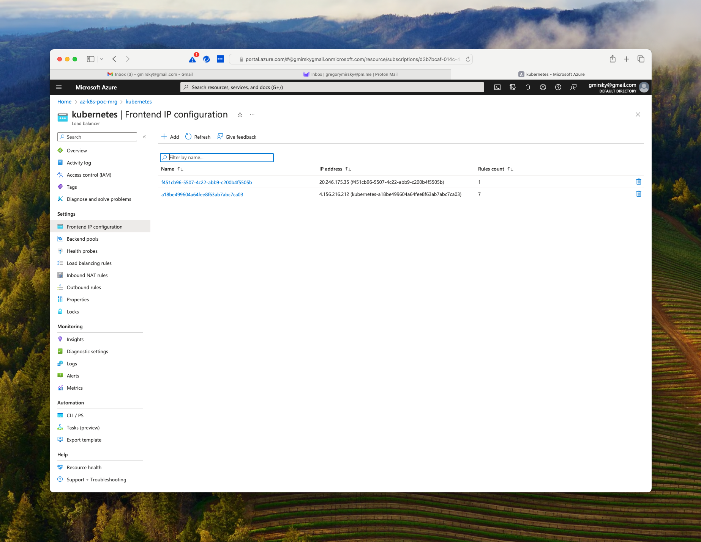
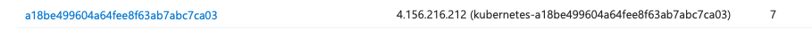
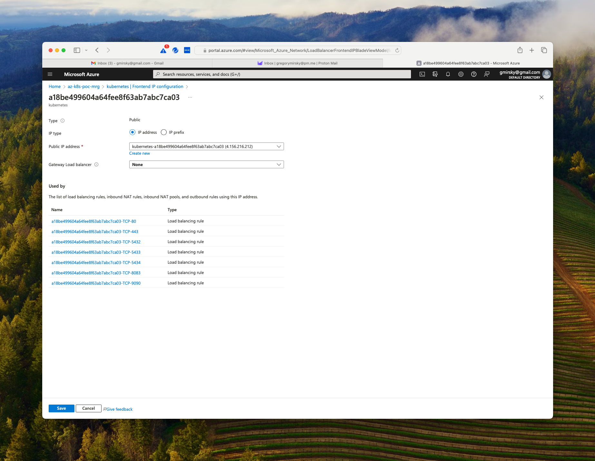
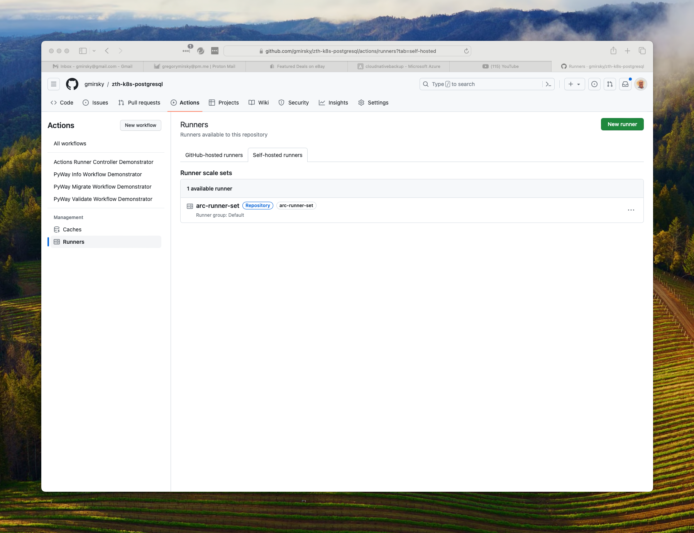

# Zero to Hero: Build a Azure AKS Kubernetes based PostgreSQL cluster with local GitHub Action Runners

Zero to Hero:  This is a fully detailed step-by-step tutorial, assuming minimal skills, that will build an Azure AKS Kubernetes cluster to host a PostgreSQL clustered database, controlled by CloudNativePG and utilize local GitHub Actions Runners to perform continuous integration / continuous deployment (CI/CD) with Python's PyWay.

The clustered Postgres database features continuous and scheduled backups to cloud based storage, monitoring with Prometheus and a Grafana dashboard. The tutorial will utilize an ingress-nginx controller so that your database, Prometheus and Grafana are available outside of your Kubernetes cluster. 

This tutorial uses Kubectl, Krew, Azure CLI or AWS CLI, Helm, Base64, GitHub Workflows and pgAdmin. Not familiar with all of these? Don't worry. There are detailed step by step instructions for you to follow along with so you can learn by doing.

------

**NOTE:** The commands below were tested in a Zsh/Bash command line environment. Some of the commands like base64 will be executed differently in Windows / Powershell and you will need to adjust the syntax accordingly.

## Prerequisites

### An Azure account

A Azure account to store the cluster automated and on-demand backups. This account will also host the Azure AKS cluster.

For Azure, if you do not have a resource group or storage account already set up you can use the following [Azure CLI ](https://learn.microsoft.com/en-us/cli/azure/install-azure-cli) commands:

#### Log into your Azure Account

```bash
# log into your Azure account
az login
```

Take note of the value in `homeTenantID` in the JSON output. (IDs have been redacted.)

```json
[
  {
    "cloudName": "AzureCloud",
    "homeTenantId": "********-8496-4ddd-a787-************",
    "id": "********-014c-4a5e-95fe-************",
    "isDefault": true,
    "managedByTenants": [],
    "name": "Pay-as-you-go",
    "state": "Enabled",
    "tenantId": "********-8496-4ddd-a787-************",
    "user": {
      "name": "********@gmail.com",
      "type": "user"
    }
  }
]
```

#### Create the Azure Resource groups

```bash
# create the Azure resource group that will host the storage account for our backups
az group create -l eastus -n cluster-example-rg

# create the Azure resource group that will host the AKS cluster
az group create -l EastUS -n az-k8s-pg-rg
```

You should get `"provisioningState": "Succeeded"` in the output JSON

```json
{
  "id": "/subscriptions/********-014c-4a5e-95fe-************/resourceGroups/cluster-example-rg",
  "location": "eastus",
  "managedBy": null,
  "name": "cluster-example-rg",
  "properties": {
    "provisioningState": "Succeeded"
  },
  "tags": null,
  "type": "Microsoft.Resources/resourceGroups"
}
```

#### Create the Azure Storage Account

**Note:** You cannot use dashes in the storage account name.

```bash
# create the Azure Storage Account
az storage account create -n clusterexamplesa -g cluster-example-rg -l eastus
```

Verify in the voluminous JSON output that `"provisioningState": "Succeeded"`, is present to determine if your storage account was created.

#### Create a container in the storage account

```bash
# create the Azure Storage Account Container
az storage container create -n clusterexample --account-name clusterexamplesa --auth-mode login
```

If everything goes correctly we should get the following JSON.

```json
{
  "created": true
}
```

#### List the Azure Storage Containers

```bash
# List Azure storage account containers
az storage container list --account-name clusterexamplesa
```

The output should look like this:

```json
[
  {
    "deleted": null,
    "encryptionScope": {
      "defaultEncryptionScope": "$account-encryption-key",
      "preventEncryptionScopeOverride": false
    },
    "immutableStorageWithVersioningEnabled": false,
    "metadata": null,
    "name": "clusterexample",
    "properties": {
      "etag": "\"0x8DC06E6A573068B\"",
      "hasImmutabilityPolicy": false,
      "hasLegalHold": false,
      "lastModified": "2023-12-27T14:18:06+00:00",
      "lease": {
        "duration": null,
        "state": "available",
        "status": "unlocked"
      },
      "publicAccess": null
    },
    "version": null
  }
]
```

#### Retrieve the Storage Account keys

Get theAzure keys for the Storage Account so that our cluster can store its automated and on demand backup to the Azure Storage Account Blob Container we just created.

```bash
# Get the storage account key list for our storage account
az storage account keys list --account-name clusterexamplesa --resource-group cluster-example-rg
```

You should get an access key back in the following form. (The keys below have been redacted.) Make a note of this key. You will need it later.

```
[
  {
    "creationTime": "2023-12-27T17:51:34.896182+00:00",
    "keyName": "key1",
    "permissions": "FULL",
    "value": "y+U5+9dS************************************************************Ryx0k4+ASt0iuHlQ=="
  },
  {
    "creationTime": "2023-12-27T14:03:44.634621+00:00",
    "keyName": "key2",
    "permissions": "FULL",
    "value": "TfdkgSUY**********************************************************sQwHJozs+AStQwEe0g=="
  }
]
```

To get the first key's value use the following:

```bash
# retrieve the first storage account key
az storage account keys list --account-name clusterexamplesa --resource-group cluster-example-rg --query "[0].value"

"y+U5+9dS************************************************************Ryx0k4+ASt0iuHlQ=="

# retrieve the second storage account key
az storage account keys list --account-name clusterexamplesa --resource-group cluster-example-rg --query "[1].value"

"jrBS+964************************************************************Qyx0k4+ASu0tuH1V=="
```

Save the keys for later use.

### Kubectl

Install Kubectl if it is not already installed, [see installing Kubectl](https://kubernetes.io/docs/tasks/tools/)

**Hint:** If you have Docker Desktop, enabling the Kubernetes option in settings will install Kubectl for you.

```bash
# get the current version of our kubectl client and the version of our kubernetes cluster
kubectl version                                                                                           
Client Version: v1.29.1
Kustomize Version: v5.0.4-0.20230601165947-6ce0bf390ce3
```

### Krew

The Cloud Native Kubectl plugin is needed to generate the Postgres Operator. [See installing Krew on how to install this plug in.](https://krew.sigs.k8s.io/docs/user-guide/setup/install/) 

```bash
# get the version of the krew kubectl plugin
kubectl krew version                                                                                     

OPTION            VALUE
GitTag            v0.4.4
GitCommit         343e657d
IndexURI          https://github.com/kubernetes-sigs/krew-index.git
BasePath          /Users/gregorymirsky/.krew
IndexPath         /Users/gregorymirsky/.krew/index/default
InstallPath       /Users/gregorymirsky/.krew/store
BinPath           /Users/gregorymirsky/.krew/bin
DetectedPlatform  darwin/arm64
```

### Helm

 Helm is required for chart installation. [See installing Helm](https://helm.sh/docs/intro/install/)

```bash
# verify the Helm version installed
helm version                                                                                             

version.BuildInfo{Version:"v3.14.0", GitCommit:"3fc9f4b2638e76f26739cd77c7017139be81d0ea", GitTreeState:"clean", GoVersion:"go1.21.6"}
```

### pgAdmin 

pgAdmin should be installed on your host system to connect to the databases. [See installing pgAdmin](https://www.pgadmin.org/download/)

### Base64

#### Linux

Install base64 (on Linux) is included in coreutils. Use your distribution's package manager to install coreutils.

#### Mac

Install base64 (on Mac) 

```bash
# Install base64
brew install base64
```

#### Windows

Install base64 (on Windows) using PowerShell

```powershell
# Install base64
Install-Module -Name Base64
```

Verify the Base64 version

```bash
# check the base64 version
base64 --version                                                                                         
base64 1.5
Last revised: 10th June 2007
The latest version is always available
at http://www.fourmilab.ch/webtools/base64
```

### Install the cnpg plugin using Krew

```bash
# Install the Krew Kubectl plugin
kubectl krew install cnpg
```

```bash
# Check the cnpg plugin and check the version
kubectl cnpg version
Build: {Version:1.22.0 Commit:86b9dc80 Date:2023-12-21}
```

#### Updating krew and cnpg plugins (if plugins are already installed.)

```bash
# Update krew plugin
kubectl krew upgrade
```

```bash
# Update cnpg plugin
kubectl krew upgrade cnpg
```

### Provision the AKS cluster

#### Find your external IP address

```bash
# find your external IP address so that you can allow yourself access to your AKS cluster
dig @resolver3.opendns.com myip.opendns.com +short

108.29.92.98
```

If you are using Windows / PowerShell you can use the following command:

```powershell
# (Windows) Find your external IP address for the az deployment command
$(Resolve-DnsName myip.opendns.com -Server resolver3.opendns.com).IPAddress

108.29.92.98
```

#### Deploy the AKS cluster

Use the following command to deploy the AKS single node cluster. For this tutorial all we need is a bare bones Kubernetes cluster. 

All of this code is in the Azure subdirectory of this repository. Make sure that you are in the Azure subdirectory when you execute this command. Replace `108.29.92.98` with your external IP address you recieved from the `dig` or `Resolve-DnsNam` command above.

```bash
# Deploy template with in-line parameters 
# place your external IP address in the authorizedIPRanges parameter
az deployment group create -g az-k8s-pg-rg \
    --template-file main.json \
    --parameters \
	resourceName=az-k8s-poc \
	managedNodeResourceGroup=az-k8s-poc-mrg \
	agentCount=1 \
	upgradeChannel=stable \
	JustUseSystemPool=true \
	osDiskType=Managed \
	osDiskSizeGB=32 \
	authorizedIPRanges="[\"108.29.92.98/32\"]" \
	ingressApplicationGateway=true
```

This process can take some time. Be patient.

#### Get your credentials for the AKS cluster

```bash
# Get credentials for your new AKS cluster & login (interactive)
az aks get-credentials -g az-k8s-pg-rg -n aks-az-k8s-poc
```

#### Get the node(s) for your AKS cluster

Starting with our clean AKS Kubernetes cluster, let's get an idea of what is running already in the cluster before we begin.

```bash
# See what nodes we have running in our docker desktop kubernetes cluster
kubectl get nodes 

NAME                                STATUS   ROLES           AGE   VERSION
aks-npuser01-28117263-vmss000000    Ready    control-plane   16h   v1.28.2
```

See what is running on the node.

```bash
# See what is running in our Kubernetes cluseter
kubectl get  all --all-namespaces   

NAMESPACE     NAME                                            READY   STATUS    RESTARTS   AGE
kube-system   pod/azure-ip-masq-agent-2k58t                   1/1     Running   0          7m12s
kube-system   pod/cloud-node-manager-2mmlr                    1/1     Running   0          7m12s
kube-system   pod/coredns-76b9877f49-6kgsj                    1/1     Running   0          6m58s
kube-system   pod/coredns-76b9877f49-xx85r                    1/1     Running   0          7m24s
kube-system   pod/coredns-autoscaler-85f7d6b75d-fttq7         1/1     Running   0          7m24s
kube-system   pod/csi-azuredisk-node-mnp9j                    3/3     Running   0          7m12s
kube-system   pod/csi-azurefile-node-dl2w2                    3/3     Running   0          7m12s
kube-system   pod/ingress-appgw-deployment-7dc8d67679-dhc89   1/1     Running   0          7m23s
kube-system   pod/konnectivity-agent-654d757cdc-6cfqc         1/1     Running   0          6m53s
kube-system   pod/konnectivity-agent-654d757cdc-d9gmt         1/1     Running   0          7m14s
kube-system   pod/kube-proxy-474cm                            1/1     Running   0          7m12s
kube-system   pod/metrics-server-c456c67cb-cwfd5              2/2     Running   0          6m53s
kube-system   pod/metrics-server-c456c67cb-rsvd8              2/2     Running   0          6m53s

NAMESPACE     NAME                     TYPE        CLUSTER-IP      EXTERNAL-IP   PORT(S)         AGE
default       service/kubernetes       ClusterIP   172.10.0.1      <none>        443/TCP         7m47s
kube-system   service/kube-dns         ClusterIP   172.10.0.10     <none>        53/UDP,53/TCP   7m24s
kube-system   service/metrics-server   ClusterIP   172.10.113.40   <none>        443/TCP         7m23s

NAMESPACE     NAME                                        DESIRED   CURRENT   READY   UP-TO-DATE   AVAILABLE   NODE SELECTOR   AGE
kube-system   daemonset.apps/azure-ip-masq-agent          1         1         1       1            1           <none>          7m24s
kube-system   daemonset.apps/cloud-node-manager           1         1         1       1            1           <none>          7m24s
kube-system   daemonset.apps/cloud-node-manager-windows   0         0         0       0            0           <none>          7m24s
kube-system   daemonset.apps/csi-azuredisk-node           1         1         1       1            1           <none>          7m24s
kube-system   daemonset.apps/csi-azuredisk-node-win       0         0         0       0            0           <none>          7m24s
kube-system   daemonset.apps/csi-azurefile-node           1         1         1       1            1           <none>          7m24s
kube-system   daemonset.apps/csi-azurefile-node-win       0         0         0       0            0           <none>          7m24s
kube-system   daemonset.apps/kube-proxy                   1         1         1       1            1           <none>          7m23s

NAMESPACE     NAME                                       READY   UP-TO-DATE   AVAILABLE   AGE
kube-system   deployment.apps/coredns                    2/2     2            2           7m24s
kube-system   deployment.apps/coredns-autoscaler         1/1     1            1           7m24s
kube-system   deployment.apps/ingress-appgw-deployment   1/1     1            1           7m23s
kube-system   deployment.apps/konnectivity-agent         2/2     2            2           7m23s
kube-system   deployment.apps/metrics-server             2/2     2            2           7m23s

NAMESPACE     NAME                                                  DESIRED   CURRENT   READY   AGE
kube-system   replicaset.apps/coredns-76b9877f49                    2         2         2       7m24s
kube-system   replicaset.apps/coredns-autoscaler-85f7d6b75d         1         1         1       7m24s
kube-system   replicaset.apps/ingress-appgw-deployment-7dc8d67679   1         1         1       7m23s
kube-system   replicaset.apps/konnectivity-agent-654d757cdc         2         2         2       7m14s
kube-system   replicaset.apps/konnectivity-agent-9b9db5545          0         0         0       7m23s
kube-system   replicaset.apps/metrics-server-576b777cd4             0         0         0       7m23s
kube-system   replicaset.apps/metrics-server-c456c67cb              2         2         2       6m53s
```

### Create namespaces

We will only need the dev namespace for this tutorial. The higher environments, `qa`, `beta` and `prod` are all optional that you can create later and deploy PostgreSQL clusters into.

```bash
# Create a new namespace called 'dev'
kubectl create namespace dev --dry-run=client -o yaml | kubectl apply -f -
```

```bash
# List out the namespaces in the kube
kubectl get namespaces --all-namespaces --show-labels                                                     
NAME              STATUS   AGE     LABELS
default           Active   8m40s   kubernetes.io/metadata.name=default
dev               Active   11s     kubernetes.io/metadata.name=dev
kube-node-lease   Active   8m43s   kubernetes.io/metadata.name=kube-node-lease
kube-public       Active   8m43s   kubernetes.io/metadata.name=kube-public
kube-system       Active   8m43s   addonmanager.kubernetes.io/mode=Reconcile,control-plane=true,kubernetes.azure.com/managedby=aks,kubernetes.io/cluster-service=true,kubernetes.io/metadata.name=kube-system
```

### Generate and install the CloudNativePG Operator

Make sure you are back in the root directory of the repository where the YAML files are.

Generate the operator CloudNativePG controller YAML manifest. The `-n` flag defines the namespace where the operator is deployed to and the replicas flag tells us how many replicas of the operator should be installed (note: number of operator replicas - not Postgres instances). For our demonstration we will pick one node but in production we would likely have 3, one for each cloud availability zone in the region.

#### Generate the CNPG YAML manifest

```bash
# Generate the YAML manifest with 1 node to deploy
kubectl cnpg install generate -n devops-system --replicas 1 > operator-manifests.yaml
```

#### Apply the CNPG YAML manifest

```bash
# Apply the YAML file to deploy the CloudNativePG Operator
# No namespace is required since it is coded in the generated YAML file
kubectl apply -f operator-manifests.yaml
```

You should get output like this:

```sh
namespace/devops-system created
customresourcedefinition.apiextensions.k8s.io/backups.postgresql.cnpg.io created
customresourcedefinition.apiextensions.k8s.io/clusters.postgresql.cnpg.io created
customresourcedefinition.apiextensions.k8s.io/poolers.postgresql.cnpg.io created
customresourcedefinition.apiextensions.k8s.io/scheduledbackups.postgresql.cnpg.io created
serviceaccount/cnpg-manager created
clusterrole.rbac.authorization.k8s.io/cnpg-manager created
clusterrolebinding.rbac.authorization.k8s.io/cnpg-manager-rolebinding created
configmap/cnpg-default-monitoring created
service/cnpg-webhook-service created
deployment.apps/cnpg-controller-manager created
mutatingwebhookconfiguration.admissionregistration.k8s.io/cnpg-mutating-webhook-configuration created
validatingwebhookconfiguration.admissionregistration.k8s.io/cnpg-validating-webhook-configuration created
```

#### Check the status of our CNPG deployment

```bash
# Check to see if the CloudNativePG Operator deployment deployed successfully
kubectl get deployment -n devops-system cnpg-controller-manager --show-labels
```

You should get output like this when the `cnpg-controller-manager` is available and ready:

```bash
NAME                      READY   UP-TO-DATE   AVAILABLE   AGE   LABELS
cnpg-controller-manager   1/1     1            1           24s   app.kubernetes.io/name=cloudnative-pg
```

### Secrets

We will need to provision secrets to our Kubernetes cluster that the other resources that we later will provision can utilize.

Passwords are base64 encoded.

To encode a password use the [Base64 Encode website](https://www.base64encode.org) so you do not have to worry about character sets and other frustrating nuances of Base64 encoding. Just make sure that your destination character set is UTF-8 and the destination new line separator is set to LF(Unix).

#### Example cluster application user secret

For our example cluster, we will create an `app` user using the `cluster-example-app-user.yaml` file.  Our sample password is `Postgres` and our sample user name is `app`.  

In production, you would use stronger passwords and not code the password into the YAML file.

```yaml
data:
  # postgres
  password: cG9zdGdyZXM=
  # app
  username: YXBw
kind: Secret
metadata:
  name: cluster-example-app-user
  labels: {
    "secret-type" : "app-user"
  }
type: kubernetes.io/basic-auth
```

To apply the secret to our `dev` namespace we use the following command.

```bash
# Create the cluster-example-app-user secret
kubectl apply -f cluster-example-app-user.yaml -n dev
```

Check to see if our secret is there:

```bash
# Check the secrets in the dev namespace
kubectl get secrets -n dev 

NAME                       TYPE                       DATA   AGE
cluster-example-app-user   kubernetes.io/basic-auth   2      18s
```

#### Example cluster super user secret

Create a super user for the PostgreSQL cluster to executer elevated privileged functions. Here, our user must be `Postgres` and the password, again, is `Postgres` for our example.

```yaml
apiVersion: v1
data:
  # postgres
  password: cG9zdGdyZXM=
  # must always be postgres
  username: cG9zdGdyZXM=
kind: Secret
metadata:
  name: cluster-example-superuser
  labels: {
    "secret-type" : "database-super-user"
  }
type: kubernetes.io/basic-auth
```

To apply the secret to our `dev` namespace we use the following command.

```bash
# Create the cluster-example-superuser secret
kubectl apply -f cluster-example-superuser.yaml -n dev
```

Verify that the secret we just applied was created:

```bash
# Check the secrets in the dev namespace
kubectl get secrets -n dev

NAME                        TYPE                       DATA   AGE
cluster-example-app-user    kubernetes.io/basic-auth   2      2m17s
cluster-example-superuser   kubernetes.io/basic-auth   2      3s
```

#### Create Kubernetes secret for backups to Azure

Another way to create credentials is directly from the kubectl command line. 

Here we will create our Azure credentials for our Kubernetes PostgreSQL cluster to back up data to. For obvious reasons, we do not want to save this information to a YAML file, so we  enter the credentials only from the command line. 

The Azure Storage Key is the value you saved from above when you created the storage account and container.

```bash
# Create a kubernetes secret in namespace dev to hold our Azure credentials
kubectl create secret generic azure-creds -n dev \
  --from-literal=AZURE_STORAGE_ACCOUNT="<storage account name>" \
  --from-literal=AZURE_STORAGE_KEY="<Storage Key save previously>" 
```

Confirm the creation of the secret.

```bash
 # Get the secrets in namespace dev 
 kubectl get secrets -n dev 

NAME                        TYPE                       DATA   AGE
azure-creds                 Opaque                     2      11s
cluster-example-app-user    kubernetes.io/basic-auth   2      94m
cluster-example-superuser   kubernetes.io/basic-auth   2      91m
```

Now let's add a label to the secret to denote what tenant it belongs to. (Note: Use your Azure tenant ID) Labels can be anything you wish.

```bash
# get the Azure tenant id
az  account show  --query "tenantId"

# Label the secret
kubectl label secret azure-creds -n dev "azure-tenant=00000000-0000-0000-0000-000000000000"                                 
```

List out the secrets with their labels.

```bash
# Get the secrets with their labels in namespace dev
kubectl get secrets  -n dev  --show-labels

NAME                        TYPE                       DATA   AGE    LABELS
azure-creds                 Opaque                     2      28m    azure-tenant=00000000-0000-0000-0000-000000000000
cluster-example-app-user    kubernetes.io/basic-auth   2      122m   secret-type=app-user
cluster-example-superuser   kubernetes.io/basic-auth   2      120m   secret-type=database-super-user
```

Verify that the keys were stored properly and can be decrypted and they produce the values you provided.

For the Azure credentials, use the following commands:

```bash
# Verify that you can decrypt the Azure Storage Account in namespace dev
kubectl get secret azure-creds -o 'jsonpath={.data.AZURE_STORAGE_ACCOUNT}' -n dev | base64 --decode

# Verify that you can decrypt the Azure Storage Account in namespace dev
kubectl get secret azure-creds -o 'jsonpath={.data.AZURE_STORAGE_KEY}' -n dev | base64 --decode
```

## Deploy a PostgreSQL Cluster

Before deploying, check that `cluster-example.yaml` has the proper configuration for your environment. 

You will  need to change the name of the Azure storage account in the `destinationPath` to the one you deployed in your Azure account.

### Backup to Azure

For Azure make sure that the `destinationPath` in the `backup` section matches the path to your container. Use the combination of credentials that suits your environment the best. 

In order to access the storage account, you will need one of the following combinations of credentials:

- [**Connection String**](https://docs.microsoft.com/en-us/azure/storage/common/storage-configure-connection-string#configure-a-connection-string-for-an-azure-storage-account)
- **Storage account name** and [**Storage account access key**](https://docs.microsoft.com/en-us/azure/storage/common/storage-account-keys-manage)
- **Storage account name** and [**Storage account SAS Token**](https://docs.microsoft.com/en-us/azure/storage/blobs/sas-service-create)
- **Storage account name** and [**Azure AD Workload Identity**](https://azure.github.io/azure-workload-identity/docs/introduction.html) properly configured.

For this tutorial, we are using the storage account name and the storage account key. 

```yaml
  backup:
    barmanObjectStore:
      destinationPath: "https://clusterexamplesa.blob.core.windows.net/cloudnativebackup"
      azureCredentials:
        # connectionString:
        #   name: azure-creds
        #   key: AZURE_CONNECTION_STRING
        storageAccount:
          name: azure-creds
          key: AZURE_STORAGE_ACCOUNT
        storageKey:
          name: azure-creds
          key: AZURE_STORAGE_KEY
        # storageSasToken:
        #   name: azure-creds
        #   key: AZURE_STORAGE_SAS_TOKEN

```

### Deploy a CloudNativePG PostgreSQL cluster to namespace dev

Now that all the secrets are in place, we will now deploy a PostgreSQL cluster into the `dev` namespace.

The cluster will have a master and two replicas. One replica is for read-only transactions and the other replica is used by the continuous backup facilities.

```bash
# Deploy a Postgresql cluster into the dev namespace
kubectl apply -f cluster-example.yaml -n dev
```

#### Check on the status of the CloudNativePG cluster

```bash
# Check the status of the cluster
kubectl cnpg status -n dev cluster-example

# Check the status of the cluster with verbose on
kubectl cnpg status -n dev cluster-example -v
```

This is what you should see initially as output:

```bash
Cluster Summary
Primary server is initializing
Name:              cluster-example
Namespace:         dev
PostgreSQL Image:  ghcr.io/cloudnative-pg/postgresql:16.0
Primary instance:   (switching to cluster-example-1)
Status:            Setting up primary Creating primary instance cluster-example-1
Instances:         3
Ready instances:   0

Certificates Status
Certificate Name             Expiration Date                Days Left Until Expiration
----------------             ---------------                --------------------------

cluster-example-ca           2024-03-17 14:18:14 +0000 UTC  90.00
cluster-example-replication  2024-03-17 14:18:14 +0000 UTC  90.00
cluster-example-server       2024-03-17 14:18:14 +0000 UTC  90.00

Continuous Backup status
Not configured

Physical backups
Primary instance not found

Streaming Replication status
Primary instance not found

Unmanaged Replication Slot Status
No unmanaged replication slots found

Instances status
Name  Database Size  Current LSN  Replication role  Status  QoS  Manager Version  Node
----  -------------  -----------  ----------------  ------  ---  ---------------  ----

Error: container not found
```

This is what you should see when the cluster has been fully deployed:

```bash
kubectl cnpg status -n dev cluster-example                                                                                                                                               ─
Cluster Summary
Name:                cluster-example
Namespace:           dev
System ID:           7315093927430983701
PostgreSQL Image:    ghcr.io/cloudnative-pg/postgresql:16.1
Primary instance:    cluster-example-1
Primary start time:  2023-12-21 17:00:33 +0000 UTC (uptime 18m23s)
Status:              Cluster in healthy state
Instances:           3
Ready instances:     3
Current Write LSN:   0/8000000 (Timeline: 1 - WAL File: 000000010000000000000007)

Certificates Status
Certificate Name             Expiration Date                Days Left Until Expiration
----------------             ---------------                --------------------------
cluster-example-ca           2024-03-20 16:55:06 +0000 UTC  89.98
cluster-example-replication  2024-03-20 16:55:06 +0000 UTC  89.98
cluster-example-server       2024-03-20 16:55:06 +0000 UTC  89.98

Continuous Backup status
First Point of Recoverability:  Not Available
Working WAL archiving:          OK
WALs waiting to be archived:    0
Last Archived WAL:              000000010000000000000007   @   2023-12-21T17:11:04.891528Z
Last Failed WAL:                -

Physical backups
No running physical backups found

Streaming Replication status
Replication Slots Enabled
Name               Sent LSN   Write LSN  Flush LSN  Replay LSN  Write Lag  Flush Lag  Replay Lag  State      Sync State  Sync Priority  Replication Slot
----               --------   ---------  ---------  ----------  ---------  ---------  ----------  -----      ----------  -------------  ----------------
cluster-example-2  0/8000000  0/8000000  0/8000000  0/8000000   00:00:00   00:00:00   00:00:00    streaming  async       0              active
cluster-example-3  0/8000000  0/8000000  0/8000000  0/8000000   00:00:00   00:00:00   00:00:00    streaming  async       0              active

Unmanaged Replication Slot Status
No unmanaged replication slots found

Managed roles status
No roles managed

Tablespaces status
No managed tablespaces

Instances status
Name               Database Size  Current LSN  Replication role  Status  QoS         Manager Version  Node
----               -------------  -----------  ----------------  ------  ---         ---------------  ----
cluster-example-1  29 MB          0/8000000    Primary           OK      BestEffort  1.22.0           docker-desktop
cluster-example-2  29 MB          0/8000000    Standby (async)   OK      BestEffort  1.22.0           docker-desktop
cluster-example-3  29 MB          0/8000000    Standby (async)   OK      BestEffort  1.22.0           docker-desktop
```

At this point, our CloudNativePG PostgreSQL cluster should be deployed.

### Monitoring the CloudNativePG PostgreSQL cluster(s)

We will install the CloudNativePG built in monitoring solution using Prometheus and Grafana to monitor our PostgreSQL clusters. Prometheus will automatically pick up monitoring data from any CNPG PostgreSQL database in the AKS cluster that has the following stanza in its deployment YAML.

```YAML
  monitoring:
    enablePodMonitor: true
```

We will use Helm to install the monitoring.

#### Install monitoring

```bash
# Check to see what Helm charts are in your local Helm repository
helm repo list

# Update the Helm charts in your repositories (if any)
helm repo update

# Add the Prometheus Community Helm chart to your local Helm repository (if not already installed)
helm repo add prometheus-community https://prometheus-community.github.io/helm-charts

# Install Prometheus monitoring using the Helm chart we just added
helm upgrade --install -f https://raw.githubusercontent.com/cloudnative-pg/cloudnative-pg/main/docs/src/samples/monitoring/kube-stack-config.yaml prometheus-community prometheus-community/kube-prometheus-stack -n devops-system 

# Check to see if Prometheus is running correctly
kubectl --namespace devops-system get pods -l "release=prometheus-community"
```

#### Install the CNPG monitoring rules

```bash
# Install CNPG sample Prometheus monotring rules
kubectl apply -f https://raw.githubusercontent.com/cloudnative-pg/cloudnative-pg/main/docs/src/samples/monitoring/prometheusrule.yaml -n devops-system 
```

#### Install Grafana dashboard

Grafana is installed with Prometheus. Below, we will install a monitoring dashboard that provides comprehensive details on our clusters.

```bash
# Install Graphana so we can use dashboards to report Prometheus data
kubectl apply -f https://raw.githubusercontent.com/cloudnative-pg/cloudnative-pg/main/docs/src/samples/monitoring/grafana-configmap.yaml -n devops-system 
```

### Initiate a manual back up of our PostgreSQL cluster

Assuming that the command `kubectl cnpg status -n dev cluster-example` returns a value of `Working WAL archiving: OK` we can initiate a manual back up of the cluster by using the YAML in `cluster-example-on-demand-backup.yaml`

```yaml
apiVersion: postgresql.cnpg.io/v1
kind: Backup
metadata:
  name: cluster-example-on-demand-backup
spec:
  method: barmanObjectStore
  cluster:
    name: cluster-example
```

`NOTE:` Backups occur from the most in-sync replica. If neither replica is in-sync then the backup is made from the primary node.

```bash
# Initiate a manual back up on the postgres cluster in namespace dev
kubectl apply -f cluster-example-on-demand-backup.yaml -n dev
```

```bash
# Check the status of the on-demand backup
kubectl describe backup cluster-example-on-demand-backup -n dev 

Name:         cluster-example-on-demand-backup
Namespace:    dev
Labels:       <none>
Annotations:  <none>
API Version:  postgresql.cnpg.io/v1
Kind:         Backup
Metadata:
  Creation Timestamp:  2023-12-27T20:13:28Z
  Generation:          1
  Resource Version:    48184
  UID:                 9035cd3d-87c3-4a09-a751-47d4ee946ee2
Spec:
  Cluster:
    Name:  cluster-example
  Method:  barmanObjectStore
Status:
  Azure Credentials:
    Storage Account:
      Key:   AZURE_STORAGE_ACCOUNT
      Name:  azure-creds
    Storage Key:
      Key:           AZURE_STORAGE_KEY
      Name:          azure-creds
  Backup Id:         20231227T201329
  Backup Name:       backup-20231227201328
  Begin LSN:         0/60538C8
  Begin Wal:         000000010000000000000006
  Destination Path:  https://clusterexamplesa.blob.core.windows.net/cloudnativebackup
  End LSN:           0/8000000
  End Wal:           000000010000000000000008
  Instance ID:
    Container ID:  docker://fe66eab7eca14d0094b4ad102658501ef220d6f003c56d820ef75673fd2d6a42
    Pod Name:      cluster-example-2
  Method:          barmanObjectStore
  Phase:           completed
  Server Name:     cluster-example
  Started At:      2023-12-27T20:13:29Z
  Stopped At:      2023-12-27T20:13:30Z
Events:
  Type    Reason     Age   From                   Message
  ----    ------     ----  ----                   -------
  Normal  Starting   44s   cloudnative-pg-backup  Starting backup for cluster cluster-example
  Normal  Starting   44s   instance-manager       Backup started
  Normal  Completed  42s   instance-manager       Backup completed
```

We now have a baseline backup of our cluster.

### Create a scheduled backup of the database cluster

If our manual backup succeeded, then we can create a scheduled backup. Manual and scheduled backups are in addition to the continuous backups.

We will use the `cluster-example-scheduled-backup.yam` file  to create a scheduled backup job. This will create a backup every two hours at five minutes past the hour.

```yaml
apiVersion: postgresql.cnpg.io/v1
kind: ScheduledBackup
metadata:
  name: cluster-example-scheduled-backup
spec:
  #  Backup every two hours at 5 minutes past the hour
  schedule: "0 5 */2 * * *"
  backupOwnerReference: self
  cluster:
    name: cluster-example
```

```bash
# Initiate an automated back up on the postgres cluster in namespace dev
kubectl apply -f cluster-example-scheduled-backup.yaml -n dev 
```

```bash
# Check the status of the scheduled backup 
kubectl describe scheduledbackup cluster-example-scheduled-backup -n dev 

Name:         cluster-example-scheduled-backup
Namespace:    dev
Labels:       <none>
Annotations:  <none>
API Version:  postgresql.cnpg.io/v1
Kind:         ScheduledBackup
Metadata:
  Creation Timestamp:  2023-12-27T20:27:09Z
  Generation:          1
  Resource Version:    49698
  UID:                 648c0bad-c669-4901-84ff-fa6de28db5d8
Spec:
  Backup Owner Reference:  self
  Cluster:
    Name:    cluster-example
  Method:    barmanObjectStore
  Schedule:  0 5 */2 * * *
Status:
  Last Check Time:  2023-12-27T20:27:09Z
Events:
  Type    Reason          Age    From                            Message
  ----    ------          ----   ----                            -------
  Normal  BackupSchedule  3m35s  cloudnative-pg-scheduledbackup  Scheduled first backup by 2023-12-27 22:05:00 +0000 UTC
```

### Display data backed up in Azure

You can display the data backed up in your Azure Storage Account Container with the following AZ CLI command:

```bash
az storage blob list --account-name clusterexamplesa --container-name cloudnativebackup --query "[*].name" --only-show-errors 

[
  "cluster-example/base/20231228T140031/backup.info",
  "cluster-example/base/20231228T140031/data.tar",
  "cluster-example/base/20231228T140500/backup.info",
  "cluster-example/base/20231228T140500/data.tar",
  "cluster-example/base/20231228T160500/backup.info",
  "cluster-example/base/20231228T160500/data.tar",
  "cluster-example/wals/0000000100000000/000000010000000000000001.snappy",
  "cluster-example/wals/0000000100000000/000000010000000000000002.snappy",
  "cluster-example/wals/0000000100000000/000000010000000000000003.snappy",
  "cluster-example/wals/0000000100000000/000000010000000000000003.00000028.backup.snappy",
  "cluster-example/wals/0000000100000000/000000010000000000000004.snappy",
  "cluster-example/wals/0000000100000000/000000010000000000000005.snappy",
  "cluster-example/wals/0000000100000000/000000010000000000000005.00000028.backup.snappy",
  "cluster-example/wals/0000000100000000/000000010000000000000006.snappy",
  "cluster-example/wals/0000000100000000/000000010000000000000007.snappy",
  "cluster-example/wals/0000000100000000/000000010000000000000008.snappy",
  "cluster-example/wals/0000000100000000/000000010000000000000009.snappy",
  "cluster-example/wals/0000000100000000/00000001000000000000000A.snappy",
  "cluster-example/wals/0000000100000000/00000001000000000000000B.snappy",
  "cluster-example/wals/0000000100000000/00000001000000000000000C.snappy",
  "cluster-example/wals/0000000100000000/00000001000000000000000D.snappy",
  "cluster-example/wals/0000000100000000/00000001000000000000000E.snappy"
```

### Expose the database and monitoring websites externally

Often, we will want to expose the database to other servers outside of the Kubernetes cluster.  There are many ways to do this depending upon your Kubernetes deployment and organization standards. 

Many cloud based Kubernetes clusters come with their own proprietary ingress controllers. For this example we will use the ingress-nginx controller to expose our database and the associated monitoring websites.

**Important**: Ingresses are only required to expose HTTP and HTTPS traffic. While the NGINX Ingress controller can, not all Ingress objects can expose arbitrary ports or protocols like port 5432.

For our AKS deployment, our ingress-nginx controller will make the underlying services that front end the actual pods available outside of our AKS cluster. Our AKS deployment comes with a load balancer that then picks up the port combinations exposed by the ingress-nginx controller and makes them available to the public IP of the balancer.

#### Install the Ingress-Nginx controller

Install the ingress-nginx controller by adding the Helm repository to our local Helm libraries.

```bash
# Add Ingress-Nginx to our local Helm repository
helm repo add ingress-nginx  https://kubernetes.github.io/ingress-nginx 
```

Check that it was added.

```bash
# List the Helm repos to verify that it was added
helm repo list
```

Get the name of the services for the PostgresSQL cluster.

```bash
# Get the services that belong to our cluster in namespace dev
kubectl get services -n dev -l cnpg.io/cluster=cluster-example                                           

NAME                 TYPE        CLUSTER-IP      EXTERNAL-IP   PORT(S)    AGE
cluster-example-r    ClusterIP   10.110.243.89   <none>        5432/TCP   4h28m
cluster-example-ro   ClusterIP   10.102.152.52   <none>        5432/TCP   4h28m
cluster-example-rw   ClusterIP   10.106.64.120   <none>        5432/TCP   4h28m
```

Get the Grafana/Prometheus service also.

```bash
# Get the Grafana service
kubectl get services -n devops-system -l app.kubernetes.io/name=grafana

NAME                           TYPE        CLUSTER-IP     EXTERNAL-IP   PORT(S)   AGE
prometheus-community-grafana   ClusterIP   10.103.92.32   <none>        80/TCP    119m

kubectl get services -n devops-system -l operated-prometheus=true

NAME                  TYPE        CLUSTER-IP   EXTERNAL-IP   PORT(S)    AGE
prometheus-operated   ClusterIP   None         <none>        9090/TCP   22m

```

Install the Nginx controller with the `dev/cluster-example-rw` service mapped to port 5432. This is our primary node that has read and write access to the PostgreSQL database cluster.

We will map `dev/cluster-example-ro to port 5433 and `dev/cluster-example-r` mapped to port 5434. We can't have these services using the same port as the read/write node of the PostgreSQL database cluster. If you wish to have applications just access the read only replica of the PostgreSQL database cluster then point them to port 5433. The fial service is generally used by the backup process to backup data but it too can be used as a read only node.

We will also map the Grafana web interface to port `8083` and the Prometheus web interface to port 9090.

```bash
# Install the Nginx Ingress controller
helm upgrade --install ingress-nginx ingress-nginx \
 --repo https://kubernetes.github.io/ingress-nginx \
 --namespace ingress-nginx \
 --create-namespace \
 --set controller.replicaCount=2 \
 --set tcp.5432="dev/cluster-example-rw:5432" \
 --set tcp.5433="dev/cluster-example-ro:5432" \
 --set tcp.5434="dev/cluster-example-r:5432" \
 --set tcp.8083="devops-system/prometheus-community-grafana:80" \
 --set tcp.9090="devops-system/prometheus-community-kube-prometheus:9090"
```

Your output should look something like this:

```bash
Release "ingress-nginx" does not exist. Installing it now.
NAME: ingress-nginx
LAST DEPLOYED: Thu Dec 28 10:37:39 2023
NAMESPACE: ingress-nginx
STATUS: deployed
REVISION: 1
TEST SUITE: None
NOTES:
The ingress-nginx controller has been installed.
It may take a few minutes for the load balancer IP to be available.
You can watch the status by running 'kubectl get service --namespace ingress-nginx ingress-nginx-controller --output wide --watch'

An example Ingress that makes use of the controller:
  apiVersion: networking.k8s.io/v1
  kind: Ingress
  metadata:
    name: example
    namespace: foo
  spec:
    ingressClassName: nginx
    rules:
      - host: www.example.com
        http:
          paths:
            - pathType: Prefix
              backend:
                service:
                  name: exampleService
                  port:
                    number: 80
              path: /
    # This section is only required if TLS is to be enabled for the Ingress
    tls:
      - hosts:
        - www.example.com
        secretName: example-tls

If TLS is enabled for the Ingress, a Secret containing the certificate and key must also be provided:

  apiVersion: v1
  kind: Secret
  metadata:
    name: example-tls
    namespace: foo
  data:
    tls.crt: <base64 encoded cert>
    tls.key: <base64 encoded key>
  type: kubernetes.io/tls
```

#### Get the public IP the AKS load balancer 

Using your Azure portal, navigate to the managed resource group (usually the same name as the resource group you specified for the AKS cluster but ending in -mrg) and find the loadbalancer (it is usually named Kubernetes) and drill down to the Frontend IP Configuration as shown below.



Since our Helm request to provision the ingress-nginx controller had specified five (5) ports to be forwarded and the ingress-nginx controller automatically provisions rules for port 80 (http) and port 443 (https) the rule count would be seven (7).



As you can see, there is a IP address for the front end. In our example it is `4.156.216.212` 

If we click on the blue frontend IP name we can see the details that include the ports we specified along with ports 80 and 443.



So IP address `4.156.216.212` is the address of our load balancer.

We should be able to access the Grafana web user interface using `http://4.156.216.212:8083` to open up the Grafana web interface.

Now, let's  go to `http://4.156.216.212:9090` and open up the Prometheus web interface.


Now let's open up the Grafa web interface at `http://4.156.216.212` Log in with the user ID `admin` and the password `prom-operator` and navigate to dashboards.


Open the CloudNativePG dashboard.


Scroll down and investigate the hundreds of parameters Prometheus captures about the PostgreSQL databases.

### Connect to the database with pgAdmin

Open up your local installation of pgAdmin. Once connected to pgAdmin click on the Add Server quick link.

In the General tab, for Name, put a meaningful name for you. Below we put cluster-example.


On the Connection tab, for Hostname address we put in the IP address from the load balancer mentioned above. For Username put the super user name, `Postgres` (or you could have put the user name `app`). For password supply the proper password. Hit save to connect and save the connection.


After successful connection to the database you should see the navigation tree on the left hand side. There will be two databases, the Postgres system database and the `app` database that we defined when we created the cluster.


### Restore a database to the cluster

Using pgAdmin, right click on databases -> Create and create a database called `dvdrental`.


Right click on the database and select `Restore`

For format choose `Directory` and in the `Filename` select the dvdrental folder in this repository. Set the number of jobs to one (1) and then click the `Restore` button.


A small window will open in the lower left with a button `View Processes`, click on it to see your restore job status. This is a small restore so it will most likely be Finished by the time you see it displayed.


You can navigate back to the database tree and drill down on the dvdrental database. Pick a table and select View/Edit Rows -> All Rows to see the data.


Congratulations! You now have a fully functional database cluster that is monitored and backed up.

## Miscellaneous 

### Getting the master pod

Since CloudNativePG can switch the primary pod, depending upon setup and environmental reasons, such as the primary pod malfunctions, you cannot assume the primary pod when the database was provisioned is still the primary node. You may need the primary pod for Kubernetes debugging or performance tuning.

To find the primary pod for the database in namespace dev use the following command:

```bash
# Get the primary database pod in namespace dev
kubectl get pods -o jsonpath={.items..metadata.name} -l cnpg.io/cluster=cluster-example,cnpg.io/instanceRole=primary -n dev

cluster-example-1%
```

## Adding Self Hosted GitHub Runners

Setting up a database cluster and backing it up is only one facet of database administration. We will now set up in our cluster local self-hosted GitHub runners that will handle Continuous Integration / Continuous Delivery (CI/CD).

**Prerequisite**: Create a Personal Access Token (Classic) for your repository, See the GitHub [documentation](https://docs.github.com/en/enterprise-server@3.9/authentication/keeping-your-account-and-data-secure/managing-your-personal-access-tokens) for more information. Also, create a repository secret called `DATABASE_PASSWORD` to house your database password.

Source SQL to be applied to the database is in the resources folder. 

You can add the self hosted GitHub Actions Runner Controller (ARC) to your Kubernetes cluster to enable CI/CD actions using PyWay.

More information regarding Pyway can be found [here](https://github.com/jasondcamp/pyway)

```bash
# Install the Helm chart for the GitHub Actions Runner Scale Set Controller
helm install arc --namespace "arc-systems" --create-namespace  \
 oci://ghcr.io/actions/actions-runner-controller-charts/gha-runner-scale-set-controller

# Set the variable for the installation name for the GitHub runners
INSTALLATION_NAME="arc-runner-set"

# Set the variable for the namespace name
NAMESPACE="arc-runners"

# Set the variable for the name of the GitHub repository that will trigger off 
# the self hosted workflow action runners
GITHUB_CONFIG_URL="https://github.com/myaccount/my-fantastic-repository"

# Set the variable for the GitHub personal access token
GITHUB_PAT="****************************************"

# Install the Helm chart for GitHub Actions Runner Scale set
helm install "${INSTALLATION_NAME}" \
    --namespace "${NAMESPACE}" \
    --create-namespace \
    --set githubConfigUrl="${GITHUB_CONFIG_URL}" \
    --set githubConfigSecret.github_token="${GITHUB_PAT}" \
    --set containerMode.type="dind" \
    oci://ghcr.io/actions/actions-runner-controller-charts/gha-runner-scale-set
```

You can check if the local GitHub Actions runners were able to communicate with GitHub by checking the GitHub Actions Runners tab.



You can use this `demonstration-workflow.yml` to test the commuincation between your repoistory and your locally hosted runners. This workflow does nothing but print out some messages in the workflow. You can manually trigger this off via the GitHub Actions panel for the repository.

```yaml
---
# This is a Actions Runner Controller Demonstrator
name: Actions Runner Controller Demonstrator

# Controls when the workflow will run
on:
  # Triggers the workflow on push or pull request events but only for the "main" branch
#  push:
#    branches: [ "main" ]
#  pull_request:
#    branches: [ "main" ]

  # Allows you to run this workflow manually from the Actions tab
  workflow_dispatch:

# A workflow run is made up of one or more jobs that can run sequentially or in parallel
jobs:
  # This workflow contains a single job called "build"
  build:
    # The type of runner that the job will run on
    runs-on: arc-runner-set

    # Steps represent a sequence of tasks that will be executed as part of the job
    steps:
      # Checks-out your repository under $GITHUB_WORKSPACE, so your job can access it
      - uses: actions/checkout@v4

      # Runs a single command using the runners shell
      - name: Run a one-line script
        run: echo "🎉 This job uses runner scale set runners!"
```

To test the PyWay connectivity to your database in the cluster you can use the follow `pyway-info.yml` workflow. Remember to change the variables to match your deployment and to adjust the values for the database host and database port to match your deployment.

```yaml
---
  name: "PyWay Info Workflow Demonstrator"
  # Controls when the action will run.
  on:
    # Allows you to run this workflow manually from the Actions tab
    workflow_dispatch:
  # Environment variables are used to pass secrets to the workflow
  env:
    database_type: postgres
    database_username: postgres
    database_password: ${{ secrets.DATABASE_PASSWORD }}
    database_host: 4.156.216.212
    database_port: 5432
    database_name: app
    database_table: public.pyway_history
  # A workflow run is made up of one or more jobs that can run sequentially or in parallel
  jobs:
      # This workflow contains a single job called "pyway_info"
      pyway_info:
          strategy:
              fail-fast: false
              matrix:
                  os: [ubuntu-latest]
          # The type of runner that the job will run on
          runs-on: arc-runner-set
          # Steps represent a sequence of tasks that will be executed as part of the job
          steps:
              # Checks-out your repository under $GITHUB_WORKSPACE, so your job can access it
              - name: Checkout repository
                uses: actions/checkout@v4
              - name: Verify Matrix.OS
                run: |
                  echo "Matrix.OS: ${{ matrix.os }}"
              # Set up Python 3.12
              # actions/setup-python doesn't yet support ARM. For ARM use deadsnakes/action@v3.1.0
              - if: ${{ matrix.os == 'ubuntu-latest' }}
                name: Set up Python 3.12 ubuntu-latest
                uses: actions/setup-python@v2
                with:
                  python-version: "3.12"
              - name: Run PyWay Info
                run: |
                  echo "Running PyWay Info Workflow Demonstrator"
                  echo "Repository: ${{ github.repository }}"
                  echo "GitHub Event Name: ${{ github.event_name }}"
                  echo "GitHub Event Path: ${{ github.event_path }}"
                  echo "GitHub Workspace: ${{ github.workspace }}"
                  python --version
                  echo "Upgrading pip"
                  python -m pip install --upgrade pip
                  echo "Installing PyWay"
                  pip install pyway
                  echo "Running PyWay Info"
                  echo "Environment variable database_type: ${{ env.database_type }}"
                  echo "Environment variable database_username: ${{ env.database_username }}"
                  echo "Environment variable database_host: ${{ env.database_host }}"
                  echo "Environment variable database_port: ${{ env.database_port }}"
                  echo "Environment variable database_name: ${{ env.database_name }}"
                  pyway info --database-type ${{ env.database_type }} --database-username ${{ env.database_username }} --database-password ${{ env.database_password }} --database-host ${{ env.database_host }} --database-port ${{ env.database_port }} --database-name ${{ env.database_name }} --database-table ${{ env.database_table }}
                  echo "PyWay Info Workflow Demonstrator finished."
  
```

**NOTE**: if the pyway table is not in the schema selected, pyway will create it whether you use the info, validate or migrate option.

If you check the workflow output, you will see output like this:

```bash
PyWay 0.3.21
Gathering info...
+-----------+-------------+----------------------------+------------+-------------------+
|   version | extension   | name                       | checksum   | apply_timestamp   |
|-----------+-------------+----------------------------+------------+-------------------|
|      1.01 | SQL         | V01_01__initial_schema.sql | new        | new               |
+-----------+-------------+----------------------------+------------+-------------------+

```

In the repository, you will also find `pyway-validate.yml` and `pyway-migrate.ym` that are both variations of the above yaml file. As the names imply, `pyway-validate.yml` will validate the SQL in the resources directory of the repository. Think of it as a dry run.

```yaml
---
    name: "PyWay Validate Workflow Demonstrator"
    # Controls when the action will run.
    on:
      # Allows you to run this workflow manually from the Actions tab
      workflow_dispatch:
    # Environment variables are used to pass secrets to the workflow
    env:
      database_type: postgres
      database_username: postgres
      database_password: ${{ secrets.DATABASE_PASSWORD }}
      database_host: 4.156.216.212
      database_port: 5432
      database_name: app
      database_table: public.pyway_history
    # A workflow run is made up of one or more jobs that can run sequentially or in parallel
    jobs:
        # This workflow contains a single job called "pyway_validate"
        pyway_validate:
            strategy:
                fail-fast: false
                matrix:
                    os: [ubuntu-latest]
            # The type of runner that the job will run on
            runs-on: arc-runner-set
            # Steps represent a sequence of tasks that will be executed as part of the job
            steps:
                # Checks-out your repository under $GITHUB_WORKSPACE, so your job can access it
                - name: Checkout repository
                  uses: actions/checkout@v4
                - name: Verify Matrix.OS
                  run: |
                    echo "Matrix.OS: ${{ matrix.os }}"
                # Set up Python 3.12
                # actions/setup-python doesn't yet support ARM. For ARM use deadsnakes/action@v3.1.0
                - if: ${{ matrix.os == 'ubuntu-latest' }}
                  name: Set up Python 3.12 ubuntu-latest
                  uses: actions/setup-python@v2
                  with:
                    python-version: "3.12"
                - name: Run PyWay Validate
                  run: |
                    echo "Running PyWay Validate Workflow Demonstrator"
                    echo "Repository: ${{ github.repository }}"
                    echo "GitHub Event Name: ${{ github.event_name }}"
                    echo "GitHub Event Path: ${{ github.event_path }}"
                    echo "GitHub Workspace: ${{ github.workspace }}"
                    python --version
                    echo "Upgrading pip"
                    python -m pip install --upgrade pip
                    echo "Installing PyWay"
                    pip install pyway
                    echo "Running PyWay Validate"
                    echo "Environment variable database_type: ${{ env.database_type }}"
                    echo "Environment variable database_username: ${{ env.database_username }}"
                    echo "Environment variable database_host: ${{ env.database_host }}"
                    echo "Environment variable database_port: ${{ env.database_port }}"
                    echo "Environment variable database_name: ${{ env.database_name }}"
                    pyway validate --database-type ${{ env.database_type }} --database-username ${{ env.database_username }} --database-password ${{ env.database_password }} --database-host ${{ env.database_host }} --database-port ${{ env.database_port }} --database-name ${{ env.database_name }} --database-table ${{ env.database_table }}
                    echo "PyWay Validate Workflow Demonstrator finished."
    
```

If you check the output for the validate workflow you will see the following output:

```shell
PyWay 0.3.21
Starting validation process

Validation completed.
```

The `pyway-migrate.yml` file differs in that the "on:" section includes information to trigger off on a push to either the `main` or `release-*` branches. This workflow will update your database. 

```yaml
---
    name: "PyWay Migrate Workflow Demonstrator"
    # Controls when the action will run. Triggers the workflow on push request
    on:
        push:
            branches:
                - main
                - release-*
            paths:
                - 'resources/**'
      # Allows you to run this workflow manually from the Actions tab
        workflow_dispatch:
    # Environment variables are used to pass secrets to the workflow
    env:
      database_type: postgres
      database_username: postgres
      database_password: ${{ secrets.DATABASE_PASSWORD }}
      database_host: 4.156.216.212
      database_port: 5432
      database_name: app
      database_table: public.pyway_history
    # A workflow run is made up of one or more jobs that can run sequentially or in parallel
    jobs:
        # This workflow contains a single job called "pyway_migrate"
        pyway_migrate:
            strategy:
                fail-fast: false
                matrix:
                    os: [ubuntu-latest]
            # The type of runner that the job will run on
            runs-on: arc-runner-set
            # Steps represent a sequence of tasks that will be executed as part of the job
            steps:
                # Checks-out your repository under $GITHUB_WORKSPACE, so your job can access it
                - name: Checkout repository
                  uses: actions/checkout@v4
                - name: Verify Matrix.OS
                  run: |
                    echo "Matrix.OS: ${{ matrix.os }}"
                # Set up Python 3.12
                # actions/setup-python doesn't yet support ARM. For ARM use deadsnakes/action@v3.1.0
                - if: ${{ matrix.os == 'ubuntu-latest' }}
                  name: Set up Python 3.12 ubuntu-latest
                  uses: actions/setup-python@v2
                  with:
                    python-version: "3.12"
                - name: Run PyWay Migrate
                  run: |
                    echo "Running PyWay Migrate Workflow Demonstrator"
                    echo "Repository: ${{ github.repository }}"
                    echo "GitHub Event Name: ${{ github.event_name }}"
                    echo "GitHub Event Path: ${{ github.event_path }}"
                    echo "GitHub Workspace: ${{ github.workspace }}"
                    python --version
                    echo "Upgrading pip"
                    python -m pip install --upgrade pip
                    echo "Installing PyWay"
                    pip install pyway
                    echo "Running PyWay Migrate"
                    echo "Environment variable database_type: ${{ env.database_type }}"
                    echo "Environment variable database_username: ${{ env.database_username }}"
                    echo "Environment variable database_host: ${{ env.database_host }}"
                    echo "Environment variable database_port: ${{ env.database_port }}"
                    echo "Environment variable database_name: ${{ env.database_name }}"
                    pyway migrate --database-type ${{ env.database_type }} --database-username ${{ env.database_username }} --database-password ${{ env.database_password }} --database-host ${{ env.database_host }} --database-port ${{ env.database_port }} --database-name ${{ env.database_name }} --database-table ${{ env.database_table }}
                    echo "PyWay Migrate Workflow Demonstrator finished."
```

If you check the workflow output you will see the following messages:

```shell
PyWay 0.3.21
Starting validation process

Validation completed.
Starting migration process...
Migrating --> V01_01__initial_schema.sql
V01_01__initial_schema.sql SUCCESS

Migration completed.
```

## Conclusion

At this point, you have a fully integrated AKS based PostgreSQL cluster with backup and monitoring with fully configured CI/CD pipelines.

## Clean up

To delete the AKS cluster, use the following Azure CLI command.

```bash
# Delete AKS cluster
az aks delete -g az-k8s-pg-rg -n aks-az-k8s-poc --yes --no-wait 
```

